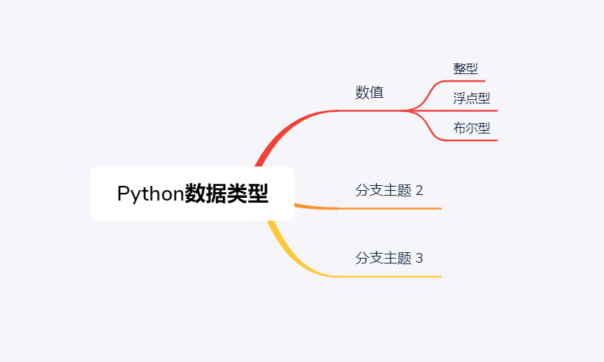

# 1.1 基本的数据类型


## <u>1 数值</u>

*记住，python中你几乎不用直接指出一个变量是什么类型，计算机会通过你给这个变量赋的值来自动判断它是什么类型。*

比如，我设置一个变量叫`n1`，`n1`是什么类型呢？不知道；但是如果我给它一个值，比如3，即`n1 = 3`，那么我们就能直到，哦，原来`n1`是个数值。

那么数值也分很多种，有**整型（就是你平常理解的整数）、浮点型（你可以理解为带小数点的数）、布尔型（bool，也就是True或者False，本身他也就是1和0）**



## <u>2 字符串</u>

顾名思义，就是串字符，简单来说，我现在说的一句话就是一个字符串。但是在python中，要把一个字符串用''来包含住。

```python
str1 = 'Hello beginer!'
```

