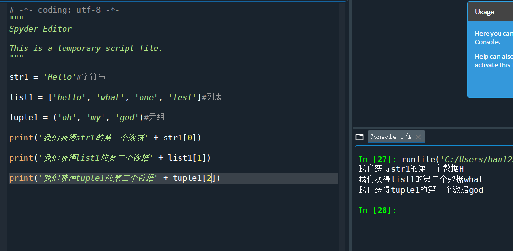
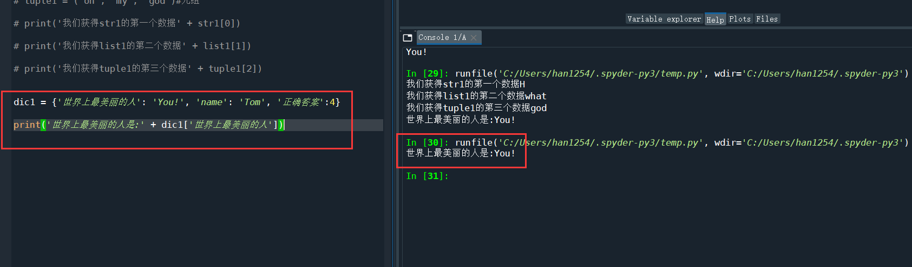
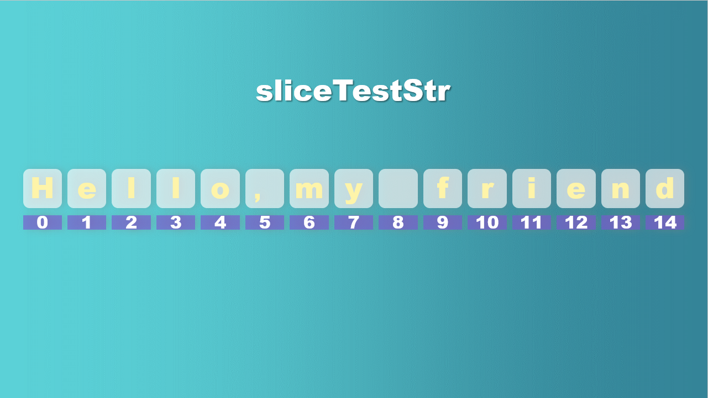
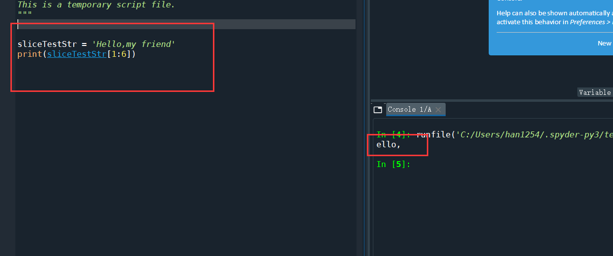
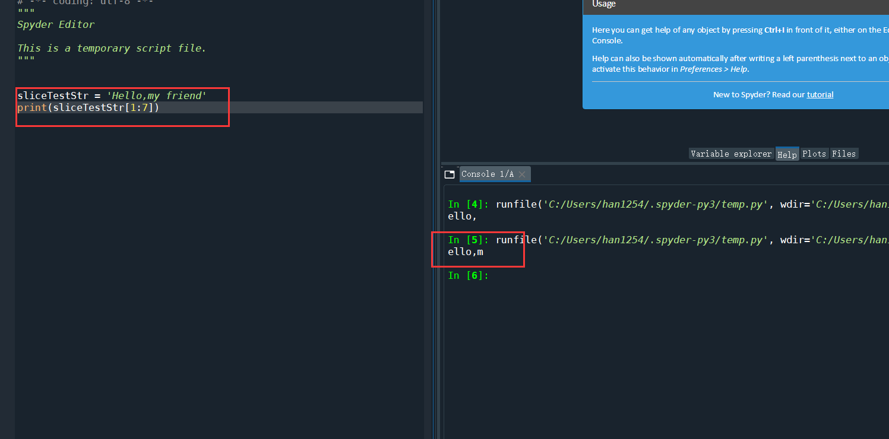
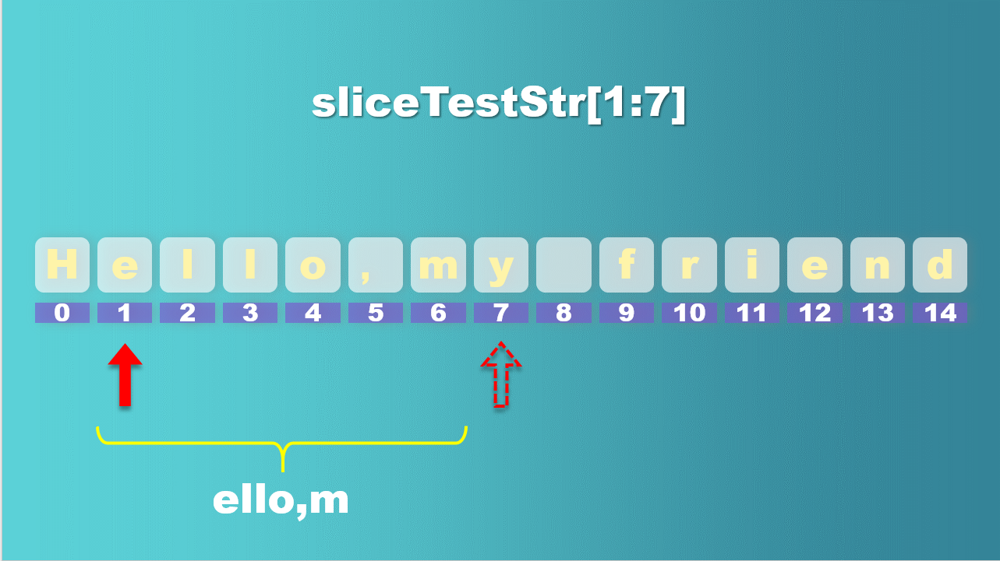
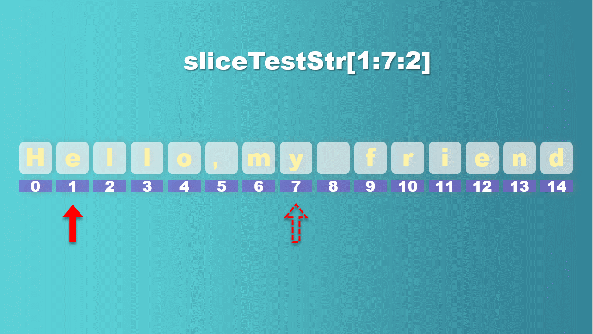
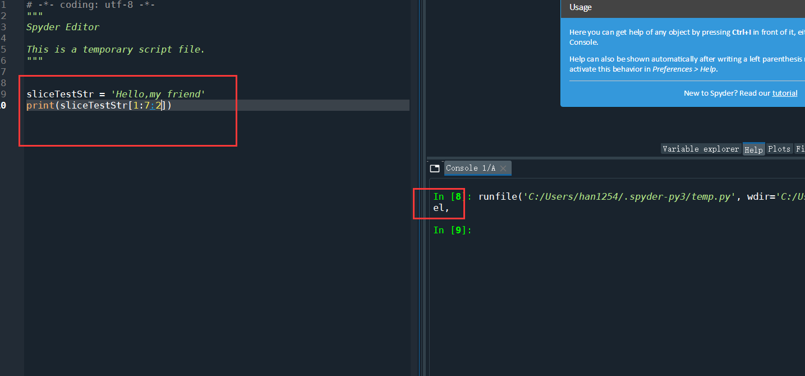
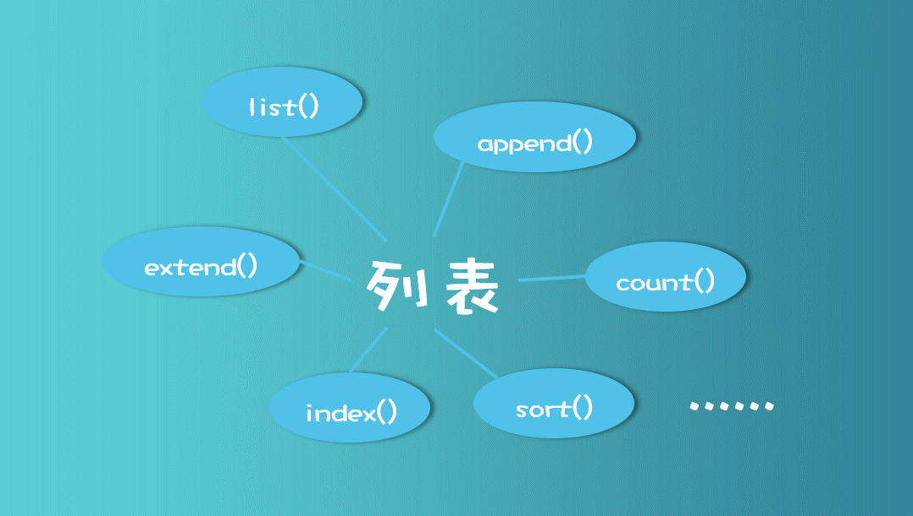

# 1.2 Python的一些公有方法

## 1 什么是方法？

我们假设一个场景，你现在正在指挥一场战斗，你需要跟另一个阵地（在敌军后方）的指挥官通信，约定“**今天晚上12点共同对敌人发起围攻**”。但是你要怎么把消息传给敌后的盟友呢？通过无线电就行。


但是你知道，这群敌人的科技水平还是可以捕获到无线电的，他们会截获你与盟军约定进攻的消息。这时候你最好的方法是什么？当然是对报文进行加密。


这时候，你需要一种机器或者一种方法——**一种能够对我的消息进行加密的方法**。

比如这种方法就叫encryption吧（encryption：加密），你想想，使用这个方法，你是不是要把你原本的信息提供给这个方法？我给这个方法一个括号，`encryption(message)`，括号里面就说明我想要一个消息，然后通过这个方法就能获得我想要的加密后的信息。

`encodeMessage = encryption(message)`

上面啰啰嗦嗦那么多，就是想让你有一个大体的意识：**方法就是用来完成一个事情，你可以给他提供一个参数(当然也可以不提供，全看你定义的时候想要什么)，完成后返回一个你想要的结果或者啥都不返回也是可以的。**


## 2 索引

<font size=2sp>**觉得好看，请叫我ppt砖家**</font>


**为防止忘记，首先来一句：集合类型不支持索引访问。**

**索引的定义**：通过**下标位置**定位访问数据。

**索引支持的数据类型有**：字符串、列表、元组

我们先翻译翻译，什么叫索引


当然，我们在python里面一定不是这个本意，但是从中文意思上，我们大致可以看出，索引是用来查找东西的。

我们想一想，老师在点名的时候，会不会经常出现老师指着某一列的同学说：“这一列的第3个同学站起来一下，回答问题”这种情况？其实这就是索引，用位置来找到你想要回答问题的学生。不过计算机里面，**我们认为第一个位置是第0位**，第二个位置是第1位……不符合常理，但是仍然要接受。

那么接下来我们开始实际操作




这里我们定义了一个字符串str1，一个列表list1，一个元组tuple1，然后分别访问他们的第1、2、3个数据

想使用索引访问，我们直接用**str1[0]**这样的形式就可以了，**名字+中括号**（括号里面是位置，比如str1的位置的取值范围就是从0到4）


而在字典类型的数据中，你想要获得某个数据，直接通过关键词，也就是键值来获得就行了。



## 3 切片

推荐阅读：

[知乎：[Python]切片完全指南(语法篇)](https://zhuanlan.zhihu.com/p/79541418)


切片这个东西，说白了就是从一串数据里面“咔嚓”切一片出来，获得一部分数据（字符串、列表、元组都可以使用切片）。



比如，我们设一个字符串`sliceTestStr = 'Hello,my friend'`  

我们想获得它的从位置1到位置6的切片，即获得'ello,m'这个字符串，顿时觉得，太简单了叭，看看书，然后写

```python
sliceTestStr = 'Hello,my friend'
print(sliceTestStr[1:6])
```

我们看看结果：



不太对劲，好像少了一个m

这里我们就要提醒读者，切片讲究一个“前闭后开”，也就是说第一个位置是正确的，但是最后一个位置我们是到不了的，我们最多能到达位置5，所以我们需要把代码改成

```python
sliceTestStr = 'Hello,my friend'
print(sliceTestStr[1:6])
```

现在我们来看一下结果：





看到了没，最后的箭头是个虚线，我们永远到达不了。

那么现在我们还有一个问题：**步长！**

当你打开书本（《python金融数据分析与挖掘实战》）的第12页，在左上方的代码中你会发现一行

```python
s24 = s2[1:6:2]
```

啊这……

别急别急，最后那个2是步长，就是一步走多远。你要是还不理解，我这里也做了一张图


如果我们第一个找到的是e，那么一个长腿欧巴，步长为2的话，下一步就走到哪里了？对，走到了l（不是数字1，是英文字母l）。

这就是步长的含义。

那么如果我要求上面这个`sliceTestStr[0:7:2]`，结果是什么呢？先考虑1分钟

我们来看一个动图



结果是'el,'，猜对了没？

要是不信就用Spyder测试一下呗



## 4 列表、元组、字典自带的方法

到这里我滴手已经酸疼了，算了，打算偷懒了


解释一下啥叫类自带的方法吧：


假设你是个忍者，不管你叫张三还是李四，只要你是个忍者，你应该就会“扔飞镖”、“嘲讽”、“土遁”等等技能，那么同样的思想你可以放到一数据类型上，比如列表。



只要一个数据，是列表，不管他叫list1还是叫list2000，都可以使用这些方法，因为他无论叫什么，他都是列表，他都自带这些方法。

其他的方法大家可以自行看书或者看网上的讲解，都不难了。只要理解了切片和索引，公有方法就没有难的了。

