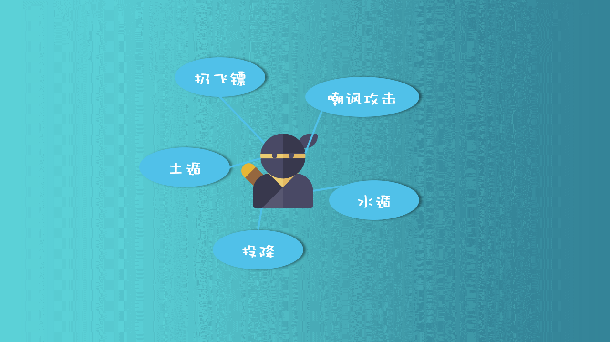
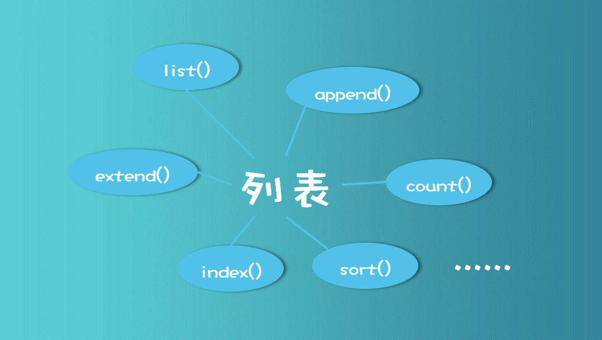

# 1.3 列表、元组和字符串方法

打算偷懒了


解释一下啥叫类自带的方法吧：



假设你是个忍者，不管你叫张三还是李四，只要你是个忍者，你应该就会“扔飞镖”、“嘲讽”、“土遁”等等技能，那么同样的思想你可以放到一数据类型上，比如列表。



只要一个数据，是列表，不管他叫list1还是叫list2000，都可以使用这些方法，因为他无论叫什么，他都是列表，他都自带这些方法。

其他的方法大家可以自行看书或者看网上的讲解，不难的😀


**追加代码：**

元组、列表以及字符串方法

```python
# 1.5.1 列表方法
L1=[1,2,3,4,5,6]      
L2=[1,2,'HE',3,5]
L3=['KJ','CK','HELLO']
L4=[1,4,2,3,8,4,7]


# 1．创建空列表：list() 
L=list()   #产生空列表L 
L=[]        #也可以用[]来产生空列表 


# 2．添加元素：append() 
L1.append('H')  # 增加元素
print(L1)
for t in L2:        #利用循环，将L2中的元素，依次顺序添加到前面新建的空列表L中
     L.append(t)
print(L) 


# 3．扩展列表：extend() 
L1.extend(L2)  # 在前面的L1基础上，添加整个L2至其后面 
print(L1)


# 4．元素计数：count() 
print('元素2出现的次数为：',L1.count(2))   


# 5．返回下标：index() 
print('H的索引下标为：',L1.index('H'))


# 6．删除元素：remove()  
L1.remove('HE') #删除HE元素
print(L1)


# 7．元素排序：sort() 
L4.sort()
print(L4)
L4[2]=10
print(L4)


# 1.5.2 元组方法 
T1=(1,2,2,4,5)
T2=('H2',3,'KL')


# 1. 创建空元组：tuple() 
t1=tuple()   #产生空元组
t=()        #产生空元组 


# 2．元素计数：count() 
print('元素2出现的次数',T1.count(2))


# 3．返回下标：index() 
print('KL的下标索引为',T2.index('KL'))


# 4．元组连接 
T3=T1+T2
print(T3)


# 1.5.3 字符串方法 
# 1．创建空字符串：str() 
S=str()    #产生空字符串 


# 2．查找子串：find() 
st='hello word!'
z1=st.find('he',0,len(st)) #返回包含子串的开始索引位置，否则-1
z2=st.find('he',1,len(st))
print(z1,z2)


# 3．替换子串：replace() 
stt=st.replace('or','kl') #原来的st不变 
print(stt) 
print(st) 


# 4．字符串连接 
st1='joh'
st2=st1+' '+st
print(st2)


# 5．字符串比较 
str1='jo'
str2='qb'
str3='qb'
s1=str1!=str2
s2=str2==str3
print(s1,s2)
```

