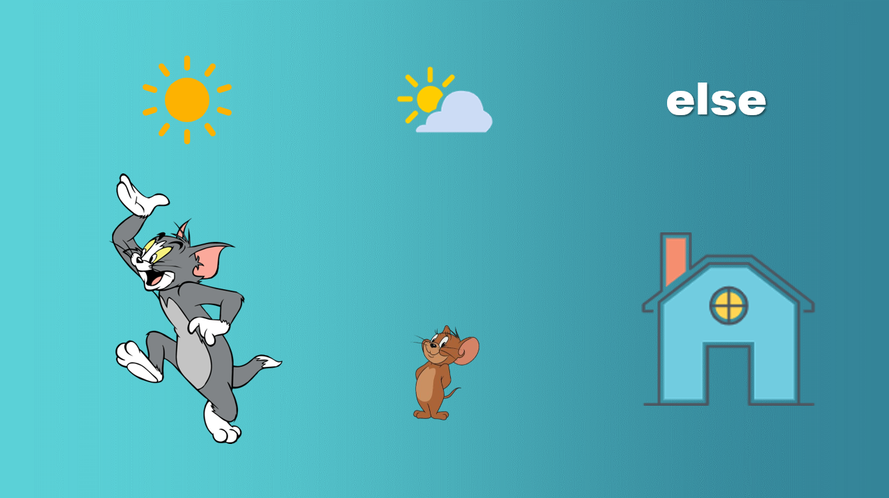
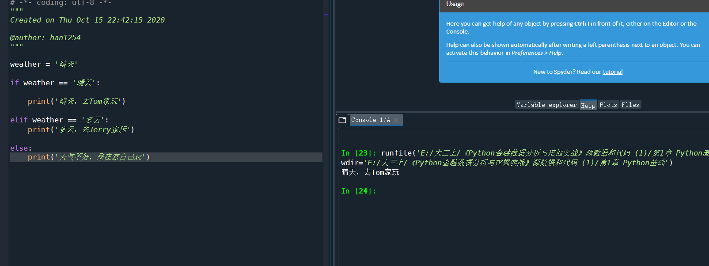
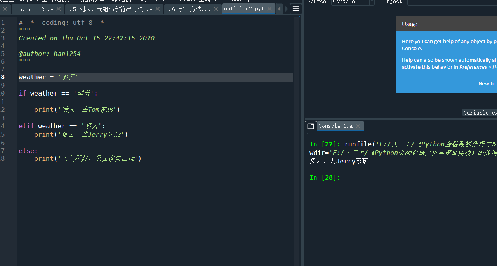
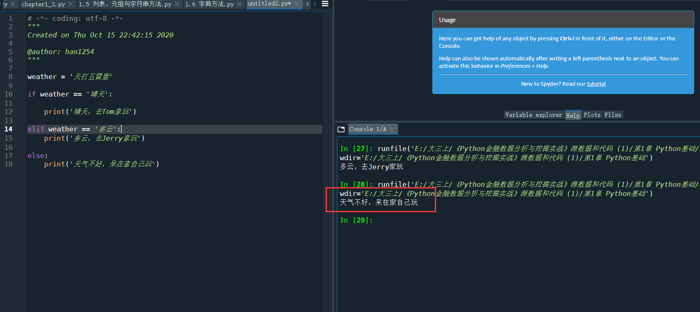
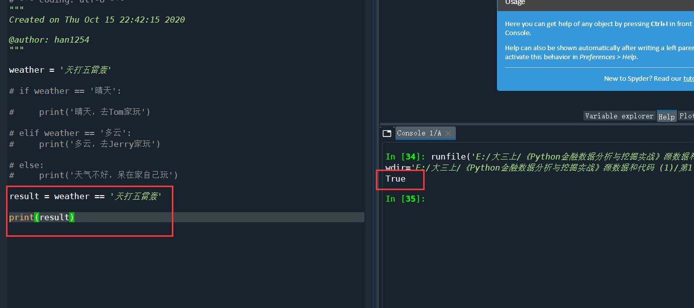
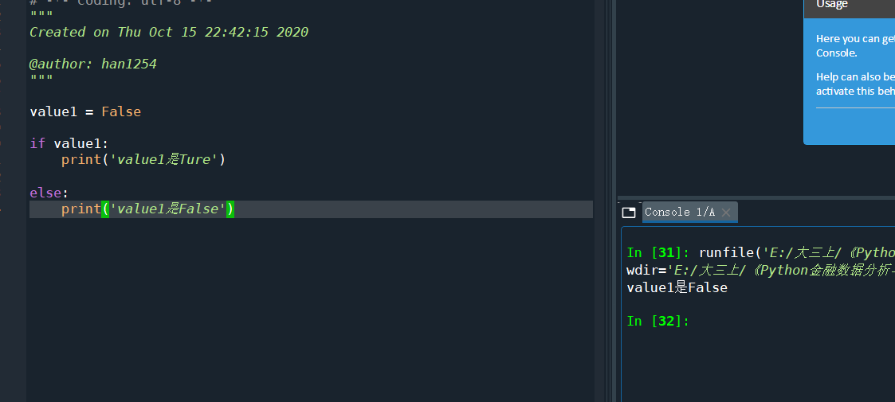
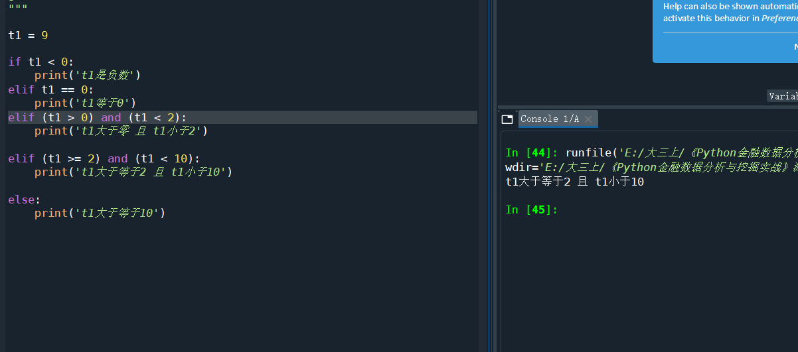

# 1.5 条件语句

> 假设你现在还是一个无忧无虑的孩子。又是一个周六的清晨，你打开电视，看天气预报——如果今天是晴天，你就去找离你家比较远的Tom玩；如果多云的话，你就去找离你家比较近的Jerry玩；如果不是晴天，也不是多云，那么这一天的天气一定很糟糕，为了避免感冒以后还得打针，你就只能呆在家里看“智慧树”了。



那么这个基本的流程用代码替代就是







**代码**

```python
# -*- coding: utf-8 -*-
"""
Created on Thu Oct 15 22:42:15 2020

@author: han1254
"""

weather = '晴天'

if weather == '晴天':
    
    print('晴天，去Tom家玩')

elif weather == '多云':
    print('多云，去Jerry家玩')
    
else:
    print('天气不好，呆在家自己玩')
```

这个例子我觉得在下一节可以改造一下

这里有几个需要注意的点：

+ 无论是if，还是elif，或者是else，它们后面跟的都是**一个判断语句**或者**一个表示真假的变量**

我们上面的例子，就是跟着一个判断语句，`weather == '晴天'`这就是一个判断语句，最后会返回True或者False。



那么我们来看一个新的例子。



```python
value1 = False

if value1: 
    print('value1是Ture')

else:
    print('value1是False')
```

+ 判断两个值相等用的是`==`，重要的事情说三遍`==`、`==`、`==`！别写成`=`了。
+ 当然，elif可以使用多次



```python

t1 = 9

if t1 < 0:
    print('t1是负数')
elif t1 == 0:
    print('t1等于0')
elif (t1 > 0) and (t1 < 2):
    print('t1大于零 且 t1小于2')
    
elif (t1 >= 2) and (t1 < 10):
    print('t1大于等于2 且 t1小于10')
    
else:
    print('t1大于等于10')
```

这里的`and`符号是“与”的意思，例如`(t1 > 0) and (t1 < 2)`就代表t1大于0且t1小于2。

+ 一个完整的判断条件，可以只有if，可以是if……else……，也可以是if……elif……elif……（中间不知道多少个elif了）……else……，反正else是可有可无的，但是if是一定要有的，这都去取决于你的逻辑是什么样子的。