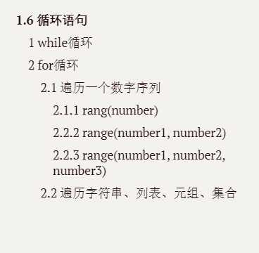
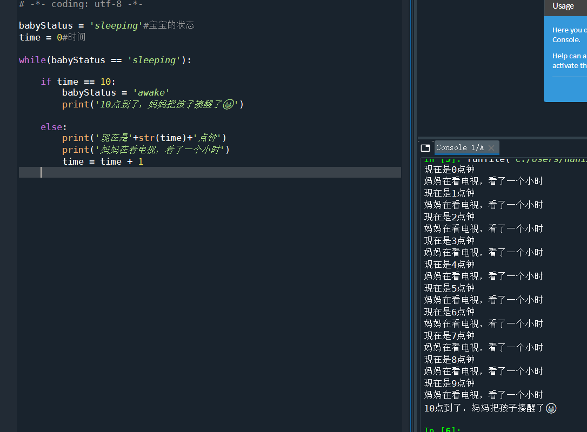
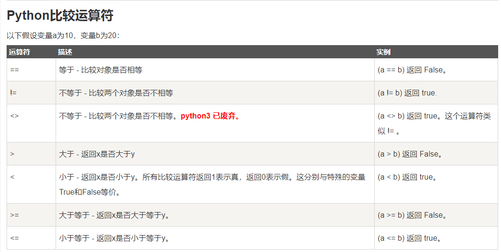
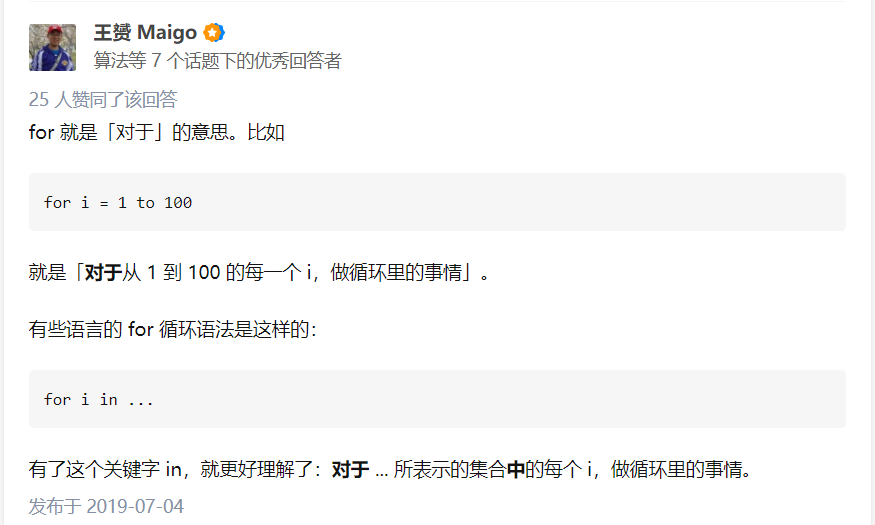
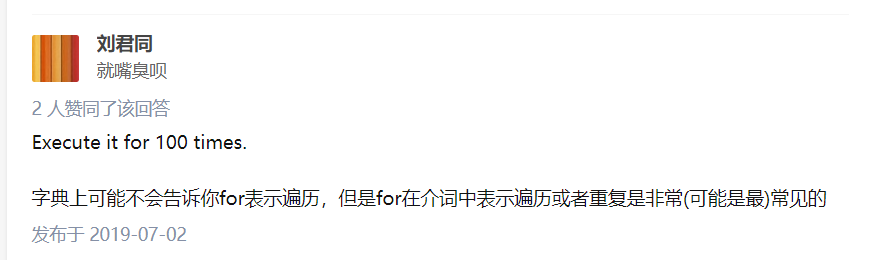
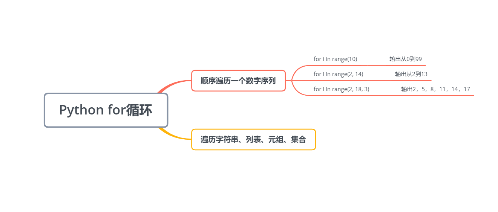
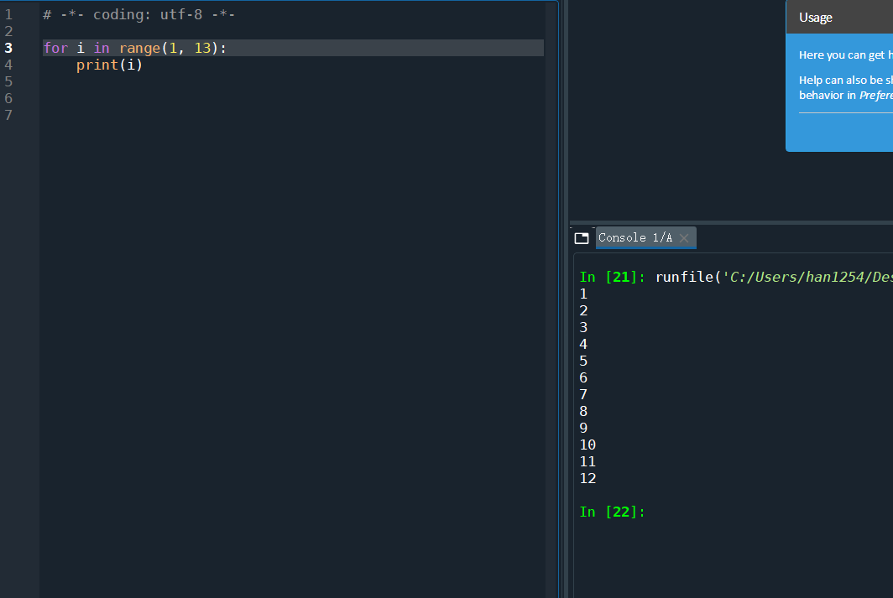
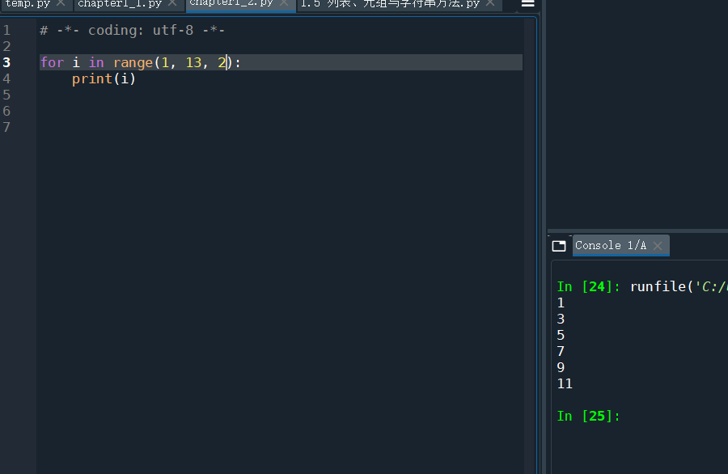
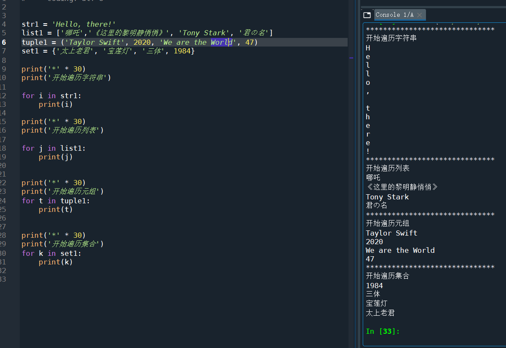

# 1.6 循环语句

本小节结构安排



## 1 while循环

现在是英语翻译时间，请翻译下面这句话

**She can keep watching TV <font color = red>while</font> her baby is sleeping.**

她的孩子还睡着，她可以一直看电视。


我们看到，这里使用了while，编程语言很多时候是对自然语言的一种简化和抽象，那么while这个关键字也是如此，我们把上面那句话抽象成编程语言

```
while(孩子还在睡觉):
    她可以看电视
```

**警告：这个代码不可执行，只是个伪代码，方便理解用的，别放到编译器上执行。**

到这里我们发现一个问题：循环语句是这样的，只要条件满足，他就会一直执行下去。孩子在睡觉——>她看电视——>孩子在睡觉——>她看电视——>孩子在睡觉——>她看电视……这孩子是睡傻了吗？咋一直不醒？这会造成什么后果？无限循环！


*(解释一下，上图是个梗，看过《奇异博士2》的童鞋应该都知道，博士面对最终大boss多玛姆，使用的就是无限循环，不停复活又不停被弄死，从心理防线上击溃多玛姆)*

<u>所以在使用循环的时候，应该记得一个原则：一定要有始有终。</u>

比如上面那个例子，我们可以规定到10点妈妈把宝宝喊醒。来实地操作一下



**代码**

```python
babyStatus = 'sleeping'#宝宝的状态
time = 0#时间

while babyStatus == 'sleeping':
    
    if time == 10:
        babyStatus = 'awake'
        print('10点到了，妈妈把孩子揍醒了😀')
        
    else:
        print('现在是'+str(time)+'点钟')
        print('妈妈在看电视，看了一个小时')
        time = time + 1
```

当你打开课本20页，看到书上的示例代码

```python
t = 100
s = 0
while t:
    s = s+t
    t = t - 1
    
print('s = ', s)
```

这个`while t:`是啥子意思？其实`while t`就是判断t是否等于0，如果`t≠0`，这个循环就会继续；如果`t==0`，这个循环就停止。



截图来源：[菜鸟教程——Python 运算符](https://www.runoob.com/python/python-operators.html)

所以上面这个代码也可以写成

```python
t = 100
s = 0
while t != 0:#当t不等于0的时候
    s = s+t
    t = t - 1
    
print('s = ', s)
```

现在我们总结一下while循环的执行过程


再使用一个动图来演示


以上两张图来源于[菜鸟教程——Python While 循环语句](https://www.runoob.com/python/python-while-loop.html)

## 2 for循环

当你一看到for循环，可能就懵了，它是啥东西啊？它咋个就循环了？


不懂就问，上知乎走起！





现在你应该有个大致的理解了，就是说我首先得有一组数据，然后我才能从头到尾遍历这串数据。

在python中，for循环的格式如下

```
for 变量 in 序列
	执行语句
```

现在我们捋一捋，什么时候需要用for循环遍历呢？

1. 我想遍历一个数字序列
2. 我想遍历一个字符串、列表、元组、集合



当你想遍历一个数字序列的时候，有三种情况，我们分别讨论一下

### 2.1 遍历一个数字序列

#### 2.1.1 rang(number)

**代码**

```python
for i in range(100):
    print(i)
```

我们来猜一猜，最后会输出什么？

从1到100吗？


答案揭晓

```
0
1
2
3
4
5
6
7
8
9
10
11
12
13
14
15
16
17
18
19
20
21
22
23
24
25
26
27
28
29
30
31
32
33
34
35
36
37
38
39
40
41
42
43
44
45
46
47
48
49
50
51
52
53
54
55
56
57
58
59
60
61
62
63
64
65
66
67
68
69
70
71
72
73
74
75
76
77
78
79
80
81
82
83
84
85
86
87
88
89
90
91
92
93
94
95
96
97
98
99
```

是从0到99，而不是我们想象中的从1到100。记住是从0开始的100个数。


#### 2.2.2 range(number1, number2)

继续实例



这里依然使用了前闭后开的原则，结果确实是从1开始的，但永远到达不了13，最后只能到达12。

#### 2.2.3 range(number1, number2, number3)

里面第三个数字是步长，就是你一步能跨多少。



看看输出的数字，是不是每一个都和前一个差2？

### 2.2 遍历字符串、列表、元组、集合



**代码**

```python
str1 = 'Hello, there!'
list1 = ['哪吒','《这里的黎明静悄悄》', 'Tony Stark', '君の名']
tuple1 = ('Taylor Swift', 2020, 'We are the World', 47)
set1 = {'太上老君', '宝莲灯', '三体', 1984}

print('*' * 30)#你看到这一句别着急，其实就是把'*'这个字符重复输出30次
print('开始遍历字符串')

for i in str1:
    print(i)

print('*' * 30)
print('开始遍历列表')

for j in list1:
    print(j)
    
    
print('*' * 30)
print('开始遍历元组')
for t in tuple1:
    print(t)
    
    
print('*' * 30)    
print('开始遍历集合')
for k in set1:
    print(k)

```


其实课本21页的示例更加具有综合性

**代码**

```python
# 1.8.2 for循环 
list1=list() 
list2=list() 
list3=list() 
for a in range(10):
    list1.append(a) 
for t in ['a','b','c','d']:
    list2.append(t) 
for q in ('k','j','p'):
    list3.append(q) 
print(list1)
print(list2) 
print(list3)
```

本节完。