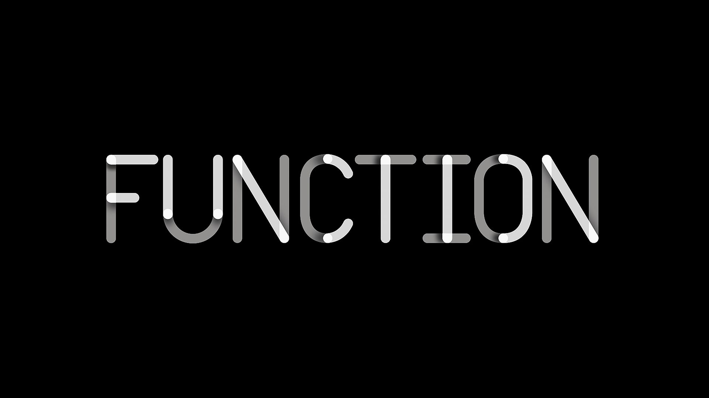
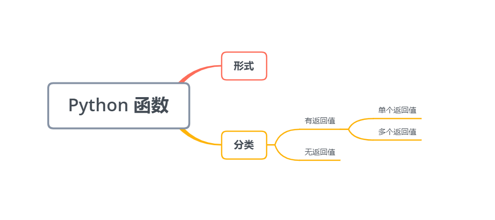
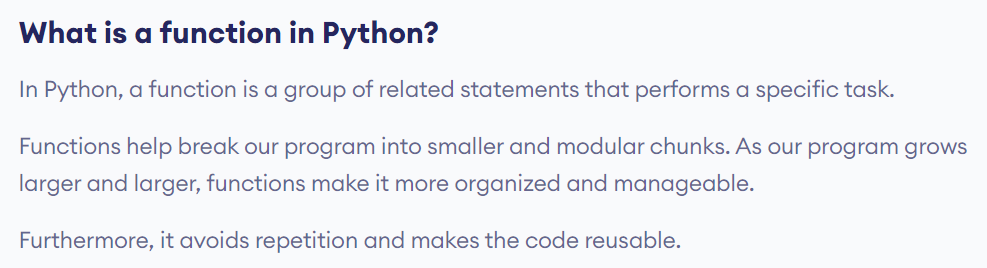
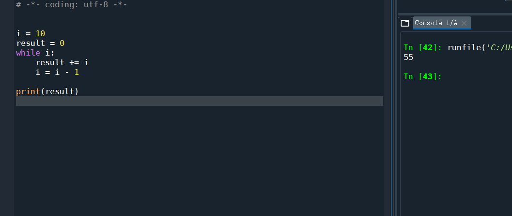
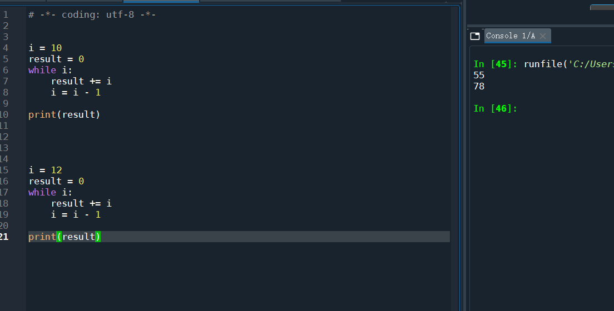
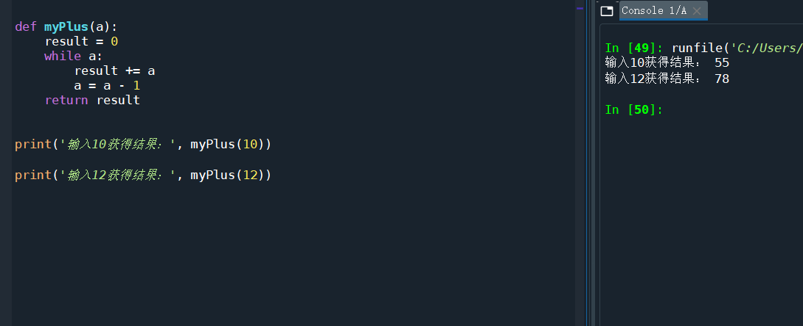
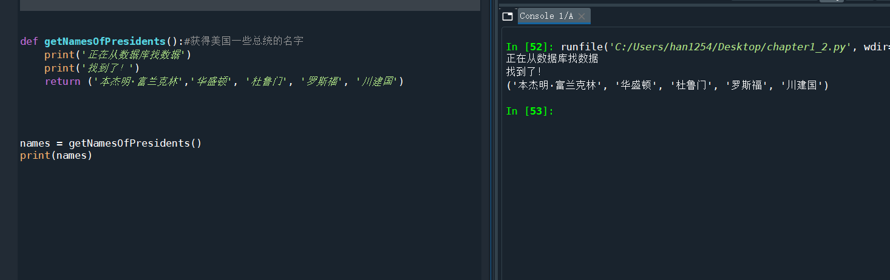

# 1.7 函数



终于来到本章的最后一节了！激动.jpg

首先我们来看看关于python函数我们需要了解什么



## 0 函数是啥？

[Python Functions](https://www.programiz.com/python-programming/function)



> 在Python中，函数是一组执行特定任务的相关语句。 函数有助于将我们的程序分解为较小的模块化块。随着我们的计划变得越来越大，功能使其变得更加有组织和可管理。 此外，它避免了重复并使代码可重复使用。

还是很难理解对吧？

还是拿课本上的题目举例子吧

比如我有一个数10，我想计算从1加到10的和，怎么计算？



```python
i = 10
result = 0
while i:#当i不等于0的时候，循环继续
    result += i#其实这句话等价于 result = result + i
    i = i - 1

print(result)
```

那如果我又有一个数12，我想计算从1加到12呢？

那继续写



那如果我还有13，20，8，9……这些数字，也想输出结果呢？难道要一个一个写吗？


答案是否定的，因为我们有函数，可以把一些重复的工作统一起来，构成一个函数，我们给函数传递一个参数，比如10，他就能直接给我们返回一个我们想要的答案。



```python 
def myPlus(a):
    result = 0
    while a:
        result += a
        a = a - 1
    return result
        
        
print('输入10获得结果：', myPlus(10))

print('输入12获得结果：', myPlus(12))
```

构成一个函数的基本要素

def + 函数名 + （参数）

其中参数是可有可无的，取决于你。

还需要注意两点

1. 注意格式
2. 注意在目前的学习进度中，函数要放到你使用它的前面的位置，通俗地说就是放在上面

## 1 有返回值的函数

格式

```
def 函数名(参数):
	函数体
	return something
```

像上面我们刚刚举的例子那样，就是一个有返回值的函数，最后会有一个return把我们需要的结果返回回去

一般情况下，我们都是只能返回一个值的，但是如果你想要返回多个值的时候怎么办？你可以把它们都放进一个元组里面。



```python
def getNamesOfPresidents():#获得美国一些总统的名字
    print('正在从数据库找数据')
    print('找到了！')
    return ('本杰明·富兰克林','华盛顿', '杜鲁门', '罗斯福', '川建国')
    

names = getNamesOfPresidents()
print(names)
```

## 2 无返回值的函数

很简单了，无返回值那就是说不使用return语句就行了。

