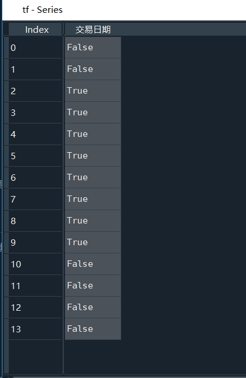

# 第三章课后习题解析


## 第一题

### <u>1.1 题目描述</u>

创建一个Python脚本，命名为test1.py，完成以下功能。

（1）读取以下四位同学的成绩并用一个数据框变量pd保存，其中成绩保存在一个TXT文件中，如下图所示（注：它们之间是以中文的“，”分割开的）


```txt
姓名，科目，成绩
小红，语文，100
小红，英语，90
小红，数学，75
张明，语文，80
张明，英语，76
张明，数学，88
小江，语文，79
小江，数学，120
小江，英语，87
小李，英语，87
小李，语文，99
小李，数学，76
```

（2）对数据框变量pd进行切片操作，分别获得小红、张明、小江、小李的各科成绩，它们是四个数据框变量，分别记为pd1，pd2，pd3，pd4。

（3）利用数据框中自身的聚合计算方法，计算并获得每个同学各科成绩的平均分，记为M1、M2、M3、M4。

### <u>1.2 解析</u>

（1）首先对第一题，我们来翻译一下这个题目，其意思就是：我用一个txt文件存了一组数据，我想把它读取并且编程一个数据框类型的数据。

```txt
姓名，科目，成绩
小红，语文，100
小红，英语，90
小红，数学，75
张明，语文，80
张明，英语，76
张明，数学，88
小江，语文，79
小江，数学，120
小江，英语，87
小李，英语，87
小李，语文，99
小李，数学，76
```

我们要把这个数据读出来，构成一个数据框类型（DataFrame）的数据。不要被名字吓到，他跟你学过的其他所有类型（整数型，字符型，元组等等）都是一个等级的，就是一种数据类型，如果你想更具体地感知的话，认为他是个表格吧，一个数据框类型就是一个表格，类似于下面这样

|      | 姓名 | 科目 | 成绩 |
| :--: | :--: | :--: | :--: |
|  0   | 小红 | 语文 | 100  |
|  1   | 小红 | 英语 |  90  |
|  2   | 小红 | 数学 |  75  |
|  3   | 张明 | 语文 |  80  |
|  4   | 张明 | 英语 |  76  |
|  5   | 张明 | 数学 |  88  |
|  6   | 小江 | 语文 |  79  |
|  7   | 小江 | 数学 | 120  |
|  8   | 小江 | 英语 |  87  |
|  9   | 小李 | 英语 |  87  |
|  10  | 小李 | 语文 |  99  |
|  11  | 小李 | 数学 |  76  |

懂了吗？所以我们读取一个txt文件，就是想要获得一个表格。

所以我们就要开始了，开始……怎么写来着？

打开课本（《Python金融数据分析与挖掘实战》）56页，我们可以看到对excel文件以及txt文件的读取

我们使用read_table()方法来读取这个文件

```python
import pandas as pd #我们引入pandas，但是名字太长了，我们暂时给他改个名，叫pd

#1(1)
#一定要确保txt文件跟程序文件是放在一个文件夹下的
data = pd.read_table('成绩单.txt', sep='，')#读取txt文件，sep参数就是说我们是用什么字符分割每个数据的
print(data)#我们可以看到打印的结果
```


第一题结束

（2）我们来到第二题

>对数据框变量pd进行切片操作，分别获得小红、张明、小江、小李的各科成绩，它们是四个数据框变量，分别记为pd1，pd2，pd3，pd4。

这里涉及到对数据框变量的切片操作。

**[-->推荐阅读：Pandas中loc和iloc函数用法详解（源码+实例）](https://blog.csdn.net/W_weiying/article/details/81411257)**


比如我们想获得小红的各科成绩，我是不是只需要找到所有“姓名”那一列上等于“小红”的那些行？


换个说法就是，我找到的这些行，是不是它们的姓名这一项都要等于“小红”，对叭?

所以我们要利用“姓名”这个列标签，应该就要使用loc属性，我们可以看看书上怎么描述的

> 数据框中的loc属性主要基于列标签进行索引，即对列值进行筛选实现行定位，再通过指定列，从而实现数据切片操作。

接下来我们就要动手操作了。

第一题中我们已经把数据读取出来了，

```python
import pandas as pd #我们引入pandas，但是名字太长了，我们暂时给他改个名，叫pd

#1(1)
#一定要确保txt文件跟程序文件是放在一个文件夹下的
data = pd.read_table('成绩单.txt', sep='，')#读取txt文件，sep参数就是说我们是用什么字符分割每个数据的
print(data)#我们可以看到打印的结果
```

我们要利用这个数据的loc属性

data.loc[确定行, 确定列]，我们如何确定需要哪些行呢？刚刚不是说了吗，我们需要那些姓名是“小红”的行。

确定行的这个空我们可以写入`data['姓名']=='小红'`

即

```python
data.loc[data['姓名']=='小红', 确定列]
```

我们来看看`data['姓名']=='小红'`到底得到的是什么？


我们看到了，这个获得的是一个序列（Series）类型的数据（不重要，别纠结他是什么类型），总之我们看到，总共12行数据，只有前三行是`True`，是不是有感觉了？也就是说`data['姓名']=='小红'`这句话会告诉data，<font size = 4>**爷只要前三行，因为前三行的数据，名字都是“小红”**！</font>


|      | 姓名 | 科目 | 成绩 |
| ---- | ---- | ---- | ---- |
| 0    | 小红 | 语文 | 100  |
| 1    | 小红 | 英语 | 90   |
| 2    | 小红 | 数学 | 75   |

那么你现在确定了你想要前三行，接下来就该确定你要哪几列了。你需要哪几列呢？题目没有要求，那我就“姓名”、“科目”、“成绩”全都要吧，小孩子才做选择题，我全都要！


那我们就使用`:`这个字符（课本55页，2.利用数据框中的loc属性进行切片，第二行），那么现在我们补充完整这个筛选的过程

```python
data.loc[data['姓名']=='小红', :]
```

写全就是

```python
#1(1)
data = pd.read_table('成绩单.txt', sep='，')
print(data)


#1(2)
pd1 = data.loc[data['姓名'] == '小红', :]
print('小红的成绩：')
print(pd1)

```


接下来该怎么做你懂得了吧？

```python
import pandas as pd

#1(1)
data = pd.read_table('成绩单.txt', sep='，')
print(data)


#1(2)
pd1 = data.loc[data['姓名'] == '小红', :]
print('小红的成绩：')
print(pd1)

pd2 = data.loc[data['姓名'] == '小江', :]
print('小江的成绩：')
print(pd2)

pd3 = data.loc[data['姓名'] == '张明', :]
print('张明的成绩：')
print(pd3)

pd4 = data.loc[data['姓名'] == '小李', :]
print('小李的成绩：')
print(pd4)

```

(3) 

> 利用数据框中自身的聚合计算方法，计算并获得每个同学各科成绩的平均分，记为M1、M2、M3、M4。

我们以pd1为例


现在我们想获得小红所有成绩的平均值，怎么办？我们首先要获得她的“成绩”这一列数据，获得的方法也很简单，`pd1['成绩']`


获得的这一列数据也是DataFrame（数据窗口）类型的，我们可以使用mean方法，对其进行求平均值。

```python
M1 = pd1['成绩'].mean()
print('小红的平均成绩：')
print(M1)

M2 = pd2['成绩'].mean()
print('小江的平均成绩：')
print(M2)

M3 = pd3['成绩'].mean()
print('张明的平均成绩：')
print(M3)

M4 = pd4['成绩'].mean()
print('小李的平均成绩：')
print(M4)
```


现在M1、M2、M3、M4都是浮点类型的数字


## 第二题

### <u>2.1 题目描述</u>

创建一个Python脚本，命名为test2.py，完成以下功能

（1）读取以下Excel表格的数据并且用一个数据框变量df保存，数据内容如下所示

| 股票代码 | 交易日期   | 收盘价 | 交易量   |
| -------- | ---------- | ------ | -------- |
| 600000   | 2017-01-03 | 16.3   | 16237125 |
| 600000   | 2017-01-04 | 16.33  | 29658734 |
| 600000   | 2017-01-05 | 16.3   | 26437646 |
| 600000   | 2017-01-06 | 16.18  | 17195598 |
| 600000   | 2017-01-09 | 16.2   | 14908745 |
| 600000   | 2017-01-10 | 16.19  | 7996756  |
| 600000   | 2017-01-11 | 16.16  | 9193332  |
| 600000   | 2017-01-12 | 16.12  | 8296150  |
| 600000   | 2017-01-13 | 16.27  | 19034143 |
| 600000   | 2017-01-16 | 16.56  | 53304724 |
| 600000   | 2017-01-17 | 16.4   | 12555292 |
| 600000   | 2017-01-18 | 16.48  | 11478663 |
| 600000   | 2017-01-19 | 16.54  | 12180687 |
| 600000   | 2017-01-20 | 16.6   | 14288268 |

（2）对df第3列、4列进行切片，切片后得到一个新的数据框记为df1，并对df1利用自身的方法转换为Numpy数组Nt。

（3）基于df第二列，构造一个逻辑数组TF，即满足交易日期小于等于2017-01-16且大于等于2017-01-05为真，否则为假。

（4）以逻辑数组TF为索引，取数组Nt中的第2列交易数据量并求和，记为S。

### <u>2.2 解析</u>

#### （1）

56页，read_excel()方法


#### （2）

>对df第3列、4列进行切片，切片后得到一个新的数据框记为df1，并对df1利用自身的方法转换为Numpy数组Nt。

翻开课本54页，我们看到两种切片方式，题目中要求我们利用下标，也就是获得第几列，那么我们可以选择`iloc`属性。

```python
df1 = df.iloc[:, 2:4]
```

第一个`:`说明我们需要所有的行，而`2:4`则说明我们需要第3和第4列。

这里要注意切片的原则——前闭后开。还要注意计算机中0代表开始

0代表开始，那么0就相当于是第一位，那么1就相当于第二位，我们想要第三和第四列，也就是2列和3列

本来是从2到3，但是切片最后一位是到达不了的，所以我们必须是从2到4。


然后我们要把它转换成Numpy数组，翻开课本53页，我们看到了as_matrix()方法

这时候我们使用它

```python
Nt = df1.as_matrix()
```


报错了！我们发现df1确实是一个数据框（DataFrame）类型的数据，但是报错显示他并没有as_matrix()这个方法。

这个错误有可能是因为我们安装的pandas版本太新（不如说是书上的教程太老了！垃圾课本），有解决办法吗？是有的。

参考这篇文章：[pandas报DataFrame object has no attribute 'as_matrix'解决办法](https://blog.csdn.net/xfei365/article/details/105128896)


我们可以这样改正：

```python
Nt = df1.values
```

这样我们获得的就是一个Numpy数组


对（2）题我们总结一下答案

答案一：

```python

import pandas as pd
import numpy as np

#2(1)
df = pd.read_excel('交易数据.xlsx')
print(df)

#2(2)
df1 = df.iloc[:, 2:4]
print(df1)
Nt = df1.as_matrix()
print(Nt)

```

如果这个答案报错了，我们就把`Nt = df1.as_matrix()`替换成`Nt = df1.values`

即

```python
import pandas as pd
import numpy as np

#2(1)
df = pd.read_excel('交易数据.xlsx')
print(df)

#2(2)
df1 = df.iloc[:, 2:4]
print(df1)
Nt = df1.values
print(Nt)
```


#### （3）

> 基于df第二列，构造一个逻辑数组TF，即满足交易日期小于等于2017-01-16且大于等于2017-01-05为真，否则为假。

这个题目我们可以先分成两个，我们先找到时间大于等于2017-01-05的行，再找到时间小于等于2017-01-16的行，最后取交集就可以了。


最后求交集

```python
TF = (df['交易日期'] <= '2017-01-16') & (df['交易日期'] >= '2017-01-05')
print(TF)
```


正好对应这几行。

#### （4）

>以逻辑数组TF为索引，取数组Nt中的第2列交易数据量并求和，记为S。

我们获得的Numpy数组Nt如下


我们获得的逻辑数组TF如下



我们想获得的是第二列从2到9行的数据，那么我们可以这样获得

```python
temp = Nt[TF, [1]]
```

TF规定我们需要哪几行，也就是为True的那几行，[1]则规定了我们只要第二列（如果是[0,1]的话那就是第一、二列了）

这就是Numpy数组的切片。详情请见课本31页。

切片后获得的结果为：


（例如2.64376e+07就是，科学计数法）

最后你可以使用python的公共方法sum()来计算temp的和，也可以使用循环来计算

```python
S = sum(temp)
print(S)
```

或者

```python
S = 0
for i in temp:
    S = S + i
    
print(S)
```

他们最后的结果都是156367094.0

我们验证一下，用excel计算（各位金融大佬都是excel高手，我只会SUM函数，惭愧）


验证成功，那么我们总结本题的答案

```python
import pandas as pd


#2(1)
df = pd.read_excel('交易数据.xlsx')
print(df)

#2(2)
#还是要遵循前闭后开的原则,:说明所有的行我全都要，2:4说明我需要2到3这两列（从0开始算起）
#54页
df1 = df.iloc[:, 2:4]
print(df1)
#pandas报DataFrame object has no attribute 'as_matrix'解决办法
#https://blog.csdn.net/xfei365/article/details/105128896
Nt = df1.values
print(Nt)

#2(3)
#https://blog.csdn.net/zhangxiaojiakele/article/details/78188574
TF = (df['交易日期'] <= '2017-01-16') & (df['交易日期'] >= '2017-01-05')
print(TF)


#2(4)
temp = Nt[TF, [1]]
S = sum(temp)
print(S)
```

## 最后总结

第一题

```python
import pandas as pd


#1(1)
data = pd.read_table('成绩单.txt', sep='，')
print(data)


#1(2)
pd1 = data.loc[data['姓名'] == '小红', :]
print('小红的成绩：')
print(pd1)

pd2 = data.loc[data['姓名'] == '小江', :]
print('小江的成绩：')
print(pd2)

pd3 = data.loc[data['姓名'] == '张明', :]
print('张明的成绩：')
print(pd3)

pd4 = data.loc[data['姓名'] == '小李', :]
print('小李的成绩：')
print(pd4)

#1(3)
M1 = pd1['成绩'].mean()
print('小红的平均成绩：')
print(M1)

M2 = pd2['成绩'].mean()
print('小江的平均成绩：')
print(M2)

M3 = pd3['成绩'].mean()
print('张明的平均成绩：')
print(M3)

M4 = pd4['成绩'].mean()
print('小李的平均成绩：')
print(M4)
```

第二题

```python
import pandas as pd


#2(1)
df = pd.read_excel('交易数据.xlsx')
print(df)

#2(2)
#还是要遵循前闭后开的原则,:说明所有的行我全都要，2:4说明我需要2到3这两列（从0开始算起）
#54页
df1 = df.iloc[:, 2:4]
print(df1)
#pandas报DataFrame object has no attribute 'as_matrix'解决办法
#https://blog.csdn.net/xfei365/article/details/105128896
Nt = df1.values
print(Nt)

#2(3)
#https://blog.csdn.net/zhangxiaojiakele/article/details/78188574
TF = (df['交易日期'] <= '2017-01-16') & (df['交易日期'] >= '2017-01-05')
print(TF)


#2(4)
temp = Nt[TF, [1]]
S = sum(temp)
print(S)

```

赶紧睡觉了，溜了溜了


