# 4.1 绘图基础

## 1 图像构成

**（1）canvas（画板）：不用管😀**

**（2）figure（画布）：**

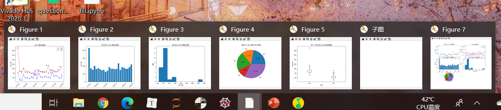

从figure1到figure7这些都是figure，你可以将figure理解为能够在上面作图的一个载体，当然画布这个比喻已经很恰当了。


**（3）axes（子图）：将figure分成不同的块，实现分面绘图**

正如上图，我们将一个画布上分成几块，分别显示不同的绘图，这些绘图就被称为子图（axes），这种使用方式也是很常见的：

下图来源：[如何在论文中画出漂亮的插图？ - 阿昆的回答 - 知乎](https://www.zhihu.com/question/21664179/answer/1182984311)**

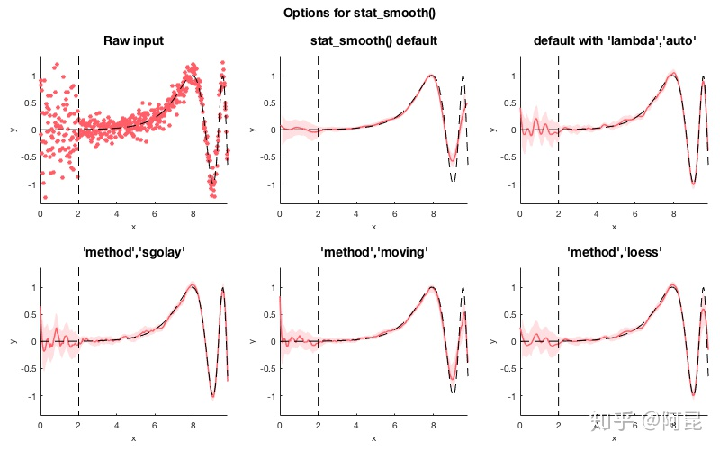

所以我们做个图来表示一下子图的位置：

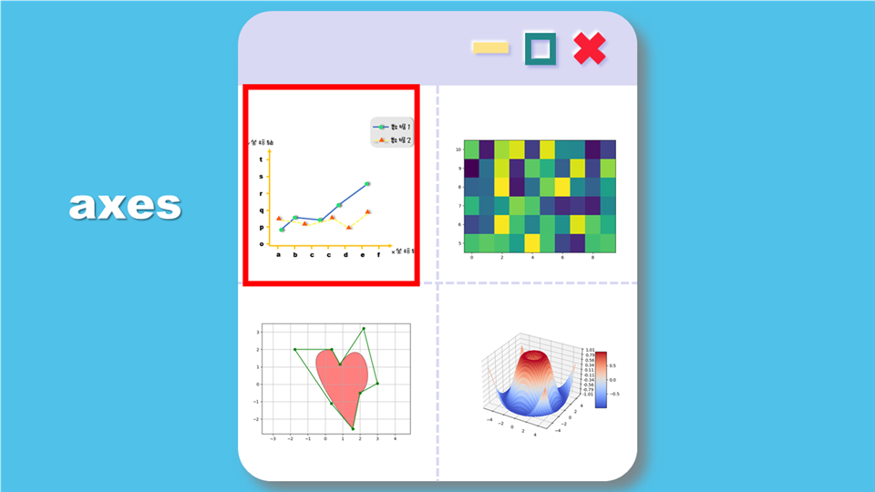

（4）图表信息：每个子图（axes）内部的元素，可以认为是一个子图中你能看到的以及你看不到的一切，都属于一个子图的图表信息。你可以通过axes调整这些内容，包括坐标轴、刻度、绘制内容等等，当然你也可以直接通过matplotlib.pyplot来操作对应的子图内的元素，**python是高度自由的一种语言，一种工作有多种不同的方式实现。**

## 2 Matplotlib绘图基本流程

为了能够理清大家的思路，我们先说一个figure只画一个子图的情况，一个figure多个axes的情况我们稍后再说。

### 2.1 创建figure

首先我们创建一个figure，这就是一个空白的画布，纯洁得像涉世未深的大学生。


```python
import matplotlib.pyplot as plt
plt.figure()
```

当然你也可以写成

```python
import matplotlib.pyplot as plt
plt.figure(1)
```

`plt.figure(1)`有两个作用：

+ 创建一个画布，规定其为画布`1`
+ 启用这个画布，接下来所有的绘制都在这个画布上

### 2.2 往里添加各种各样的东西

当上一节我们创建一个figure后，它本身就会自然存在一个坐标系，或者存在一个子图了。

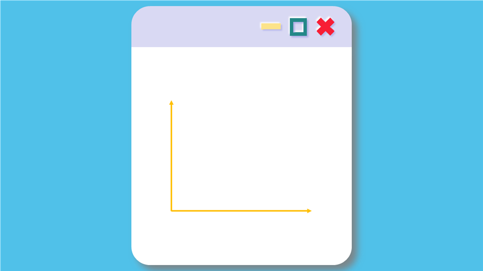

我们可以直接使用`matplotlib.pyplot`来操作里面的所有元素。

比如我们可以使用`xlabel`这个方法为x轴添加名称，y轴同理。

```python
import matplotlib.pyplot as plt
plt.rcParams['font.sans-serif'] = 'SimHei'#防止中文乱码
plt.figure()
plt.xlabel('x轴')
plt.ylabel('y轴')
```

（注意，这里我使用的Jupyter Notebook，可以边写边输出，如果跟你的编译器不一样，不要惊慌）

（注意，这里我并没有设置x轴和y轴的刻度，目前的刻度都是默认的）

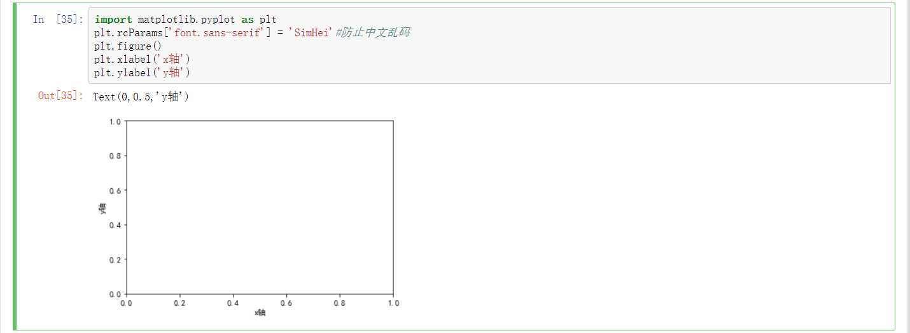

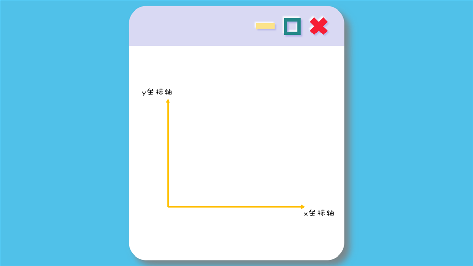

然后，我们可以确定x轴和y轴的刻度范围，使用`xlim`方法和`ylim`方法。

```python
import matplotlib.pyplot as plt
plt.rcParams['font.sans-serif'] = 'SimHei'#防止中文乱码
plt.figure()
plt.xlabel('x轴')
plt.ylabel('y轴')
plt.xlim((0, 6))
plt.ylim((0, 5))
```

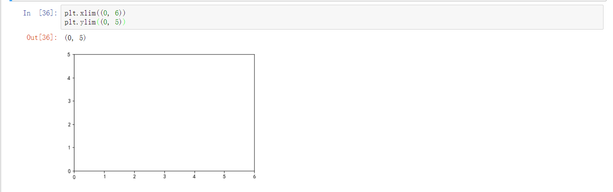

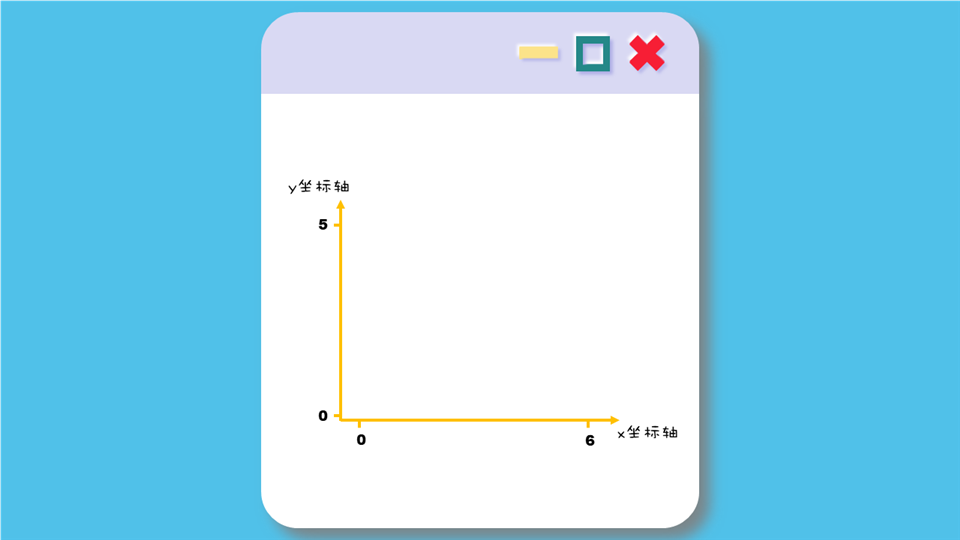

接下来我们可以为x轴和y轴设置刻度以及设置刻度的字符标注。

首先我们设置刻度

```python
import matplotlib.pyplot as plt
import numpy as np
plt.rcParams['font.sans-serif'] = 'SimHei'#防止中文乱码
plt.figure()
plt.xlabel('x轴')
plt.ylabel('y轴')
plt.xlim((0, 6))
plt.ylim((0, 5))

x_ticks = np.linspace(0, 6, 3)#👈我们目前到这里了
y_ticks = np.linspace(0, 5, 4)
plt.xticks(x_ticks)
plt.yticks(y_ticks)
```

上述指向的代码的含义是从0到6总共产生3个刻度，我们稍微想一想，那就是0、3、6这三个刻度

那么同理，`y_ticks`代表的应该是4个刻度，y轴的一个刻度应该代表着`5/4`，1.666.......。我们看看运行结果

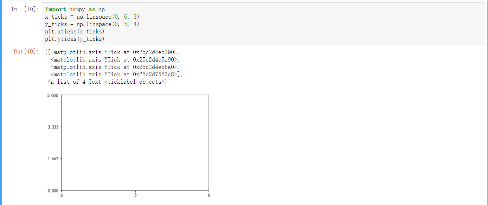

当然这样看着也别扭，那么接下来我就还是按照这组代码继续往下写了

```python
import matplotlib.pyplot as plt
import numpy as np
plt.rcParams['font.sans-serif'] = 'SimHei'#防止中文乱码
plt.figure()
plt.xlabel('x轴')
plt.ylabel('y轴')
plt.xlim((0, 6))
plt.ylim((0, 5))

x_ticks = np.linspace(0, 6, 7)
y_ticks = np.linspace(0, 5, 6)
plt.xticks(x_ticks)
plt.yticks(y_ticks)
```


这时候我们已经有一个比较完整的坐标系了，这时候你会想，我不想让刻度显示0、1、2……我想让它显示a、b、c、d……能作到吗？没问题。无论是`xticks`方法还是`yticks`方法，都可以给刻度设置不同的标识，只需要把你想设置的名字放到第二个参数里面就行了。

```python
import matplotlib.pyplot as plt
import numpy as np
plt.rcParams['font.sans-serif'] = 'SimHei'#防止中文乱码
plt.figure()
plt.xlabel('x轴')
plt.ylabel('y轴')
plt.xlim((0, 6))
plt.ylim((0, 5))

x_ticks = np.linspace(0, 6, 7)
y_ticks = np.linspace(0, 5, 6)
x_label = ['a', 'b', 'c', 'd', 'e', 'f', 'g']
y_label = ['o', 'p', 'q', 'r', 's']
plt.xticks(x_ticks, x_label)
plt.yticks(y_ticks, y_label)
plt.show()
```

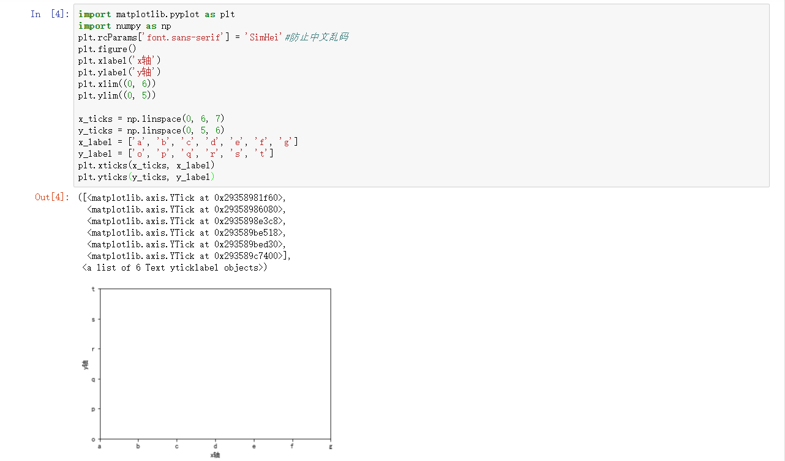

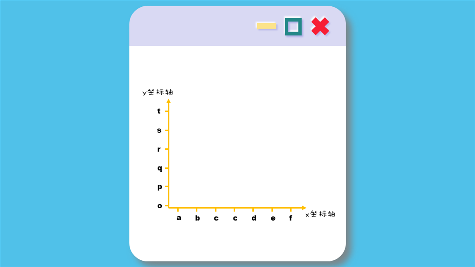

接下来也到了关键的地方，关键的地方，要绘制内容了。

`plt.plot()`方法里面需要传入两个参数，一个x，一个y，这两个应该是大小一样的数组，一一对应着构成一个一个的点。

（注意，如果你的x是用numpy.linspace()函数生成的，并且y是利用函数生成的，比如`y = x ** 2`或者`y = x`，这样你传入后生成的图像就是连续而圆滑的）

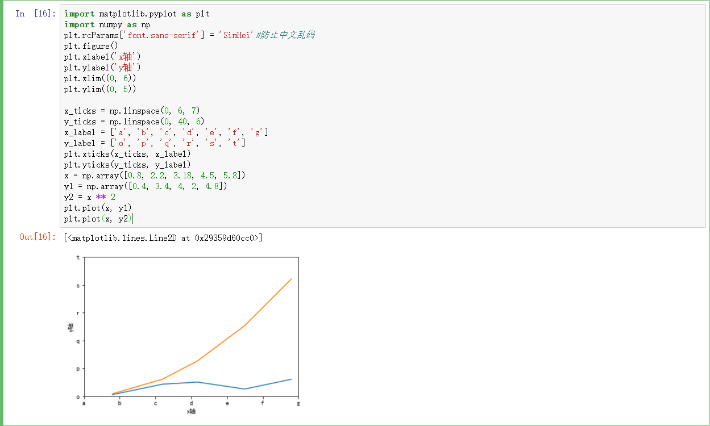

```python
import matplotlib.pyplot as plt
import numpy as np
plt.rcParams['font.sans-serif'] = 'SimHei'#防止中文乱码
plt.figure()
plt.xlabel('x轴')
plt.ylabel('y轴')
plt.xlim((0, 6))
plt.ylim((0, 5))

x_ticks = np.linspace(0, 6, 7)
y_ticks = np.linspace(0, 40, 6)
x_label = ['a', 'b', 'c', 'd', 'e', 'f', 'g']
y_label = ['o', 'p', 'q', 'r', 's', 't']
plt.xticks(x_ticks, x_label)
plt.yticks(y_ticks, y_label)
x = np.array([0.8, 2.2, 3.18, 4.5, 5.8])
y1 = np.array([0.4, 3.4, 4, 2, 4.8])
y2 = x ** 2
plt.plot(x, y1)
plt.plot(x, y2)
```

这时候如果你想要添加图例，使用`lengend()函数`

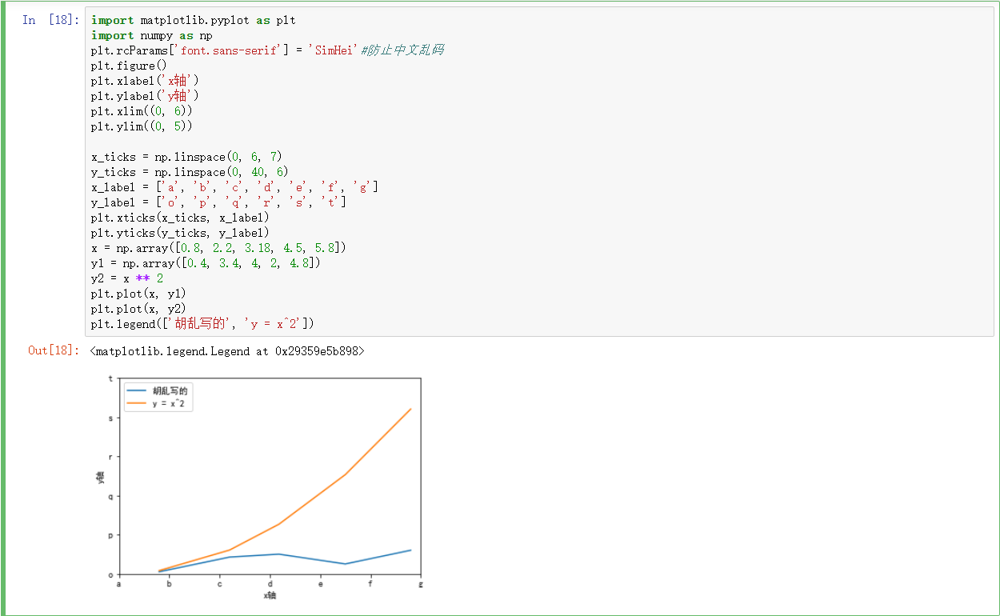

```python
import matplotlib.pyplot as plt
import numpy as np
plt.rcParams['font.sans-serif'] = 'SimHei'#防止中文乱码
plt.figure()
plt.xlabel('x轴')
plt.ylabel('y轴')
plt.xlim((0, 6))
plt.ylim((0, 5))

x_ticks = np.linspace(0, 6, 7)
y_ticks = np.linspace(0, 40, 6)
x_label = ['a', 'b', 'c', 'd', 'e', 'f', 'g']
y_label = ['o', 'p', 'q', 'r', 's', 't']
plt.xticks(x_ticks, x_label)
plt.yticks(y_ticks, y_label)
x = np.array([0.8, 2.2, 3.18, 4.5, 5.8])
y1 = np.array([0.4, 3.4, 4, 2, 4.8])
y2 = x ** 2
plt.plot(x, y1)
plt.plot(x, y2)
plt.legend(['胡乱写的', 'y = x^2'])
```

最后再设置一下格式

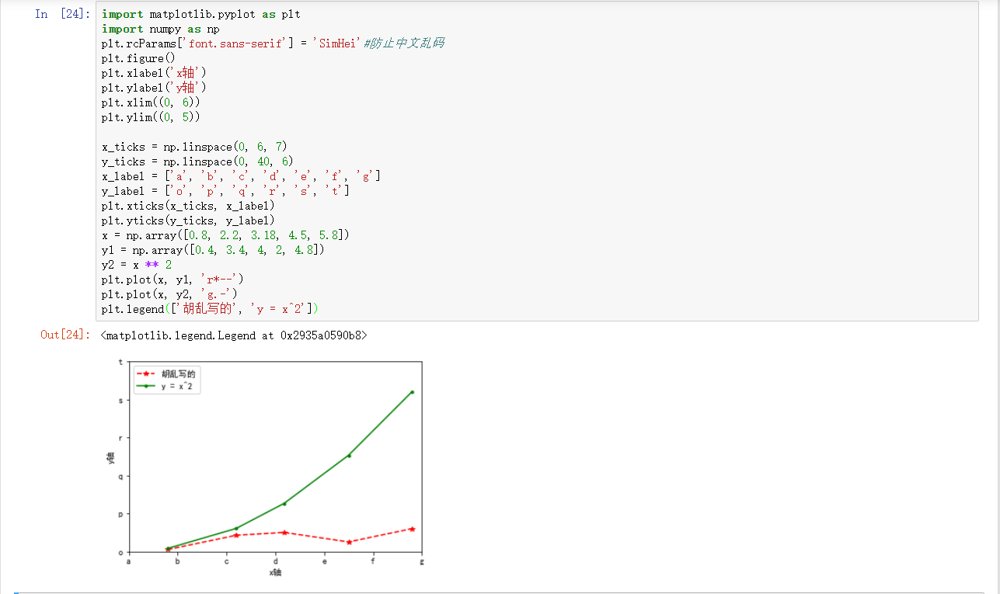

```python
import matplotlib.pyplot as plt
import numpy as np
plt.rcParams['font.sans-serif'] = 'SimHei'#防止中文乱码
plt.figure()
plt.xlabel('x轴')
plt.ylabel('y轴')
plt.xlim((0, 6))
plt.ylim((0, 5))

x_ticks = np.linspace(0, 6, 7)
y_ticks = np.linspace(0, 40, 6)
x_label = ['a', 'b', 'c', 'd', 'e', 'f', 'g']
y_label = ['o', 'p', 'q', 'r', 's', 't']
plt.xticks(x_ticks, x_label)
plt.yticks(y_ticks, y_label)
x = np.array([0.8, 2.2, 3.18, 4.5, 5.8])
y1 = np.array([0.4, 3.4, 4, 2, 4.8])
y2 = x ** 2
plt.plot(x, y1, 'r*--')#进行了格式设置
plt.plot(x, y2, 'g.-')#进行了格式设置
plt.legend(['胡乱写的', 'y = x^2'])
```

这样就大功告成了！