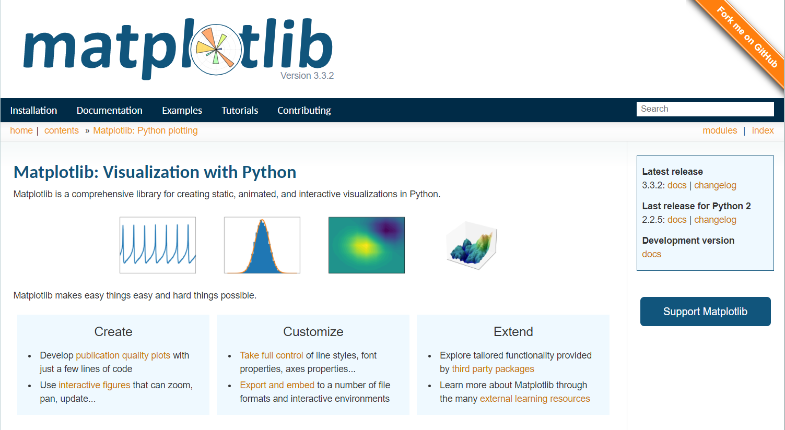

# 4.2 常用绘图

常用绘图

年轻人，想要力量吗？想要力量就去官网，把所有用法都啃下来，你就是专家了！！！！！！！！！

[指路君———>matplotlib官网](https://matplotlib.org/api/pyplot_summary.html)

温馨提示，本小节用到的excel文件（车次上车人数统计表.xlsx）可以从百度网盘下载：

[点击进入百度网盘](https://pan.baidu.com/s/1MEkCX8PTnGXaf3jFj_GVQg)

提取码：ne99

