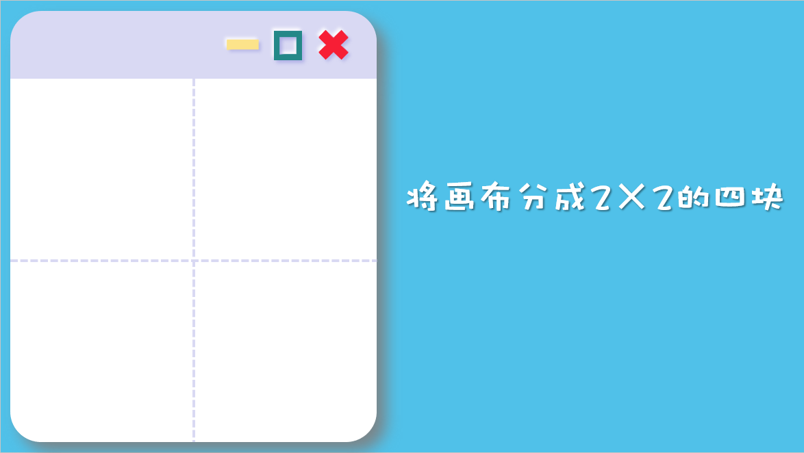

# 子图

对于子图，可以先去我写的4.1节“绘图基础”复习一下，理解一下什么是子图。

书上的例子太过复杂，我们写个简单一点的。

```python
import pandas as pd
import numpy as np
import matplotlib.pyplot as plt

data = pd.read_excel("车次上车人数统计表.xlsx")
plt.rcParams['axes.unicode_minus'] = False#设置能显示负号

plt.subplot(2, 2, 1)
r1 = data.loc[data['车次']=='D02', '上车人数']
r2 = data.loc[data['车次']=='D03', '上车人数']
plt.boxplot([r1.values, r2.values])
plt.xticks([1, 2], labels=['D01', 'D02'])


plt.subplot(2, 2, 2)
r3 = data.loc[data['车次']=='D02', :]
y = r3.loc[:, '上车人数']
x = np.arange(1, len(r3) + 1)
plt.plot(x, y)
plt.title('D02上车人数折线图')


plt.subplot(2, 2, 3)
r4 = data.loc[data['车次']=='D03', :]
y = r4.loc[:, '上车人数']
x = np.arange(1, len(r4) + 1)
plt.plot(x, y, '^--r')
plt.title('D03上车人数折线图')


plt.subplot(2, 2, 4)
x = np.linspace(0, 10, 1000)
y = np.sin(x);
plt.plot(x, y, 'g')

```


我们首先来看看这句`plt.subplot(2, 2, 1)`的含义

它的含义就是，把当前的figure画布分成2×2的块，并且使用第一块





```python
plt.subplot(2, 2, 1)
r1 = data.loc[data['车次']=='D02', '上车人数']
r2 = data.loc[data['车次']=='D03', '上车人数']
plt.boxplot([r1.values, r2.values])
plt.xticks([1, 2], labels=['D01', 'D02'])
```

这样，接下来的所有操作都会发生在第一块。


同理，当第一块的任务完成后，你可以使用`plt.subplot(2, 2, 2)`来绘制第二块的内容。这时候figure已经被划分为四块了，就不会再划分了，会直接使用第二块子图来绘制图像。

只要理解了子图划分和子图的位置后，其他绘制流程与之前一致。

Ps：书上的这种使用方法并不是matplotlib官方推荐的，但是为了与课本保持一致，避免读者患上精神分裂，我还是采用了课本上的方法。所以如果你以后在别的地方看到了不一样的用法，不要惊慌，毕竟python是一门高度自由化的语言，能用很多不同的方式实现同一个功能，记住一种方式就行了。


到这里，本章的基本内容也就结束了，能看到这里也是很不容易了，加油！上学人。


![微信加油上学人表情包分享-加油上学人表情包下载[图文]-游戏窝](子图.assets/20201030093451_20756.jpg)