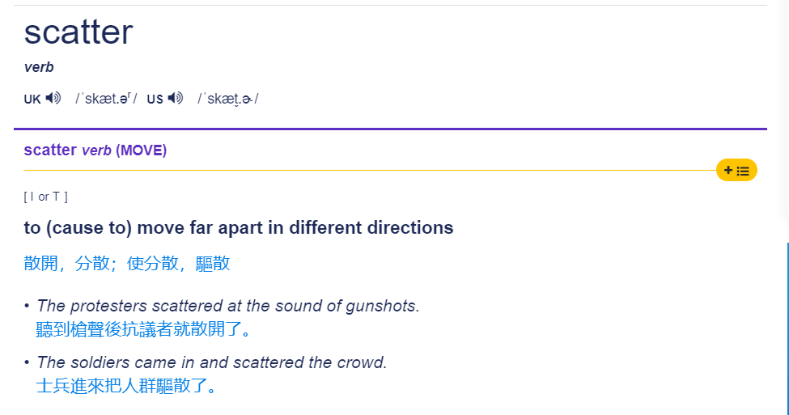
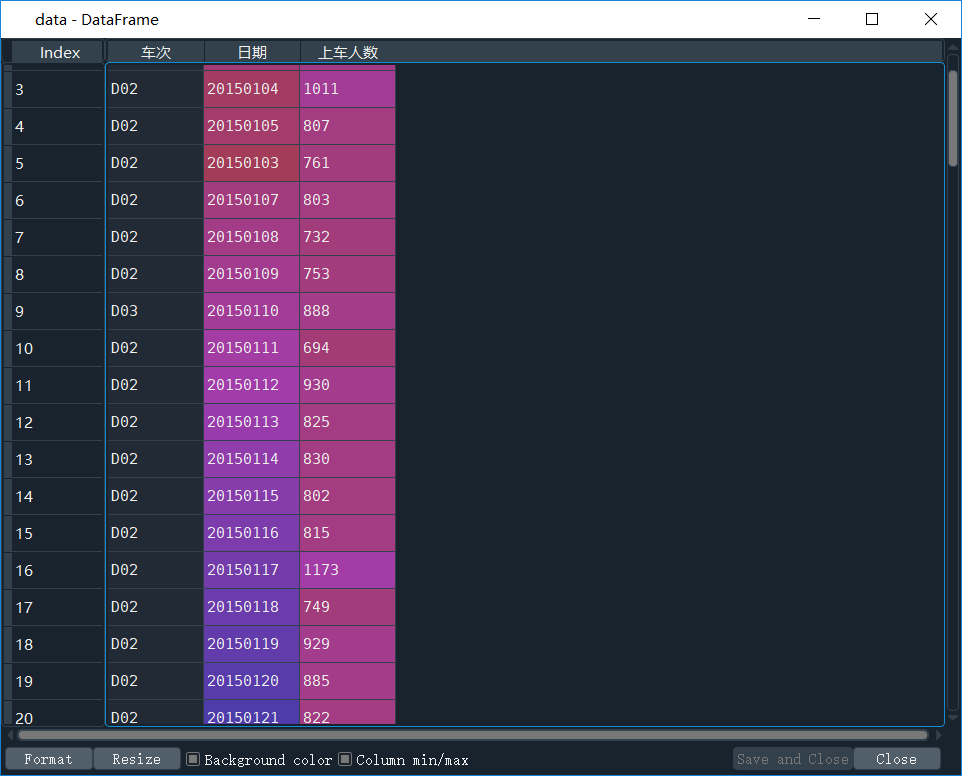
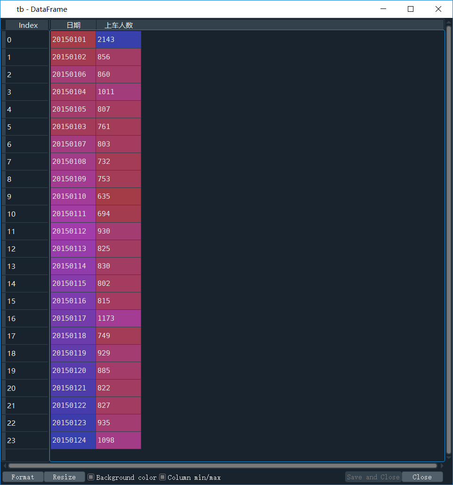
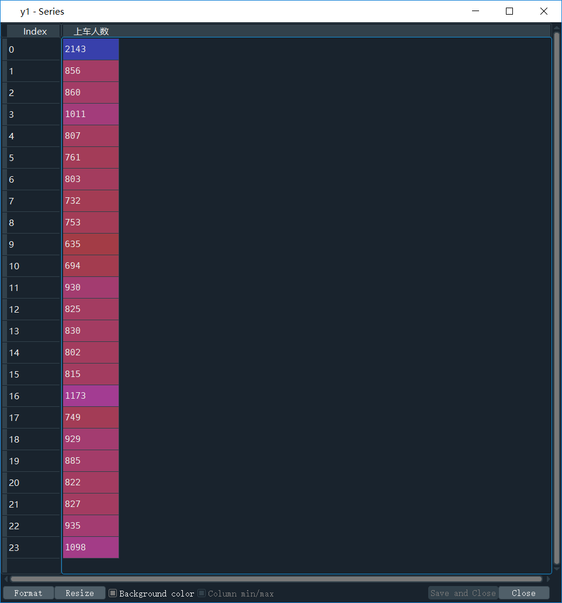
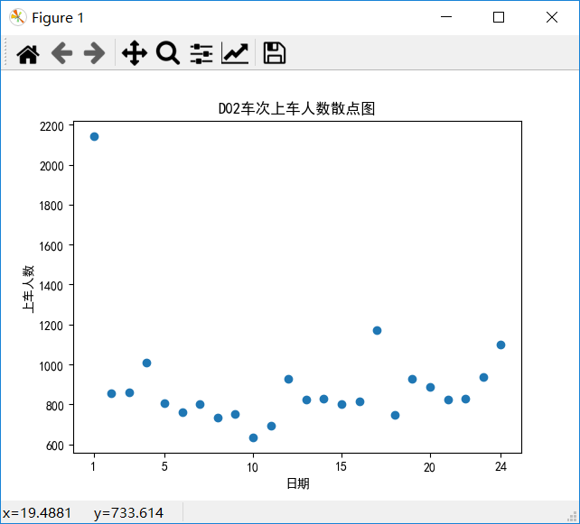
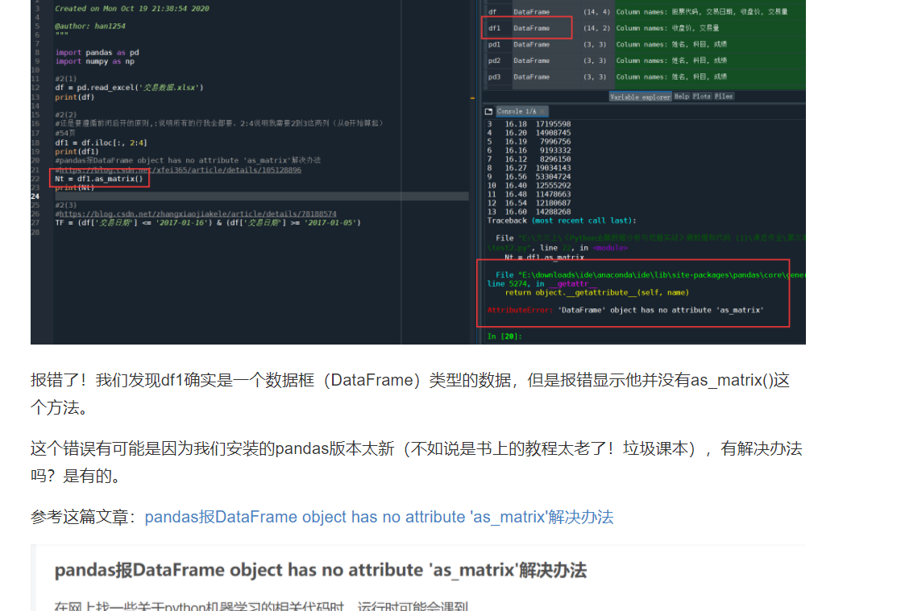
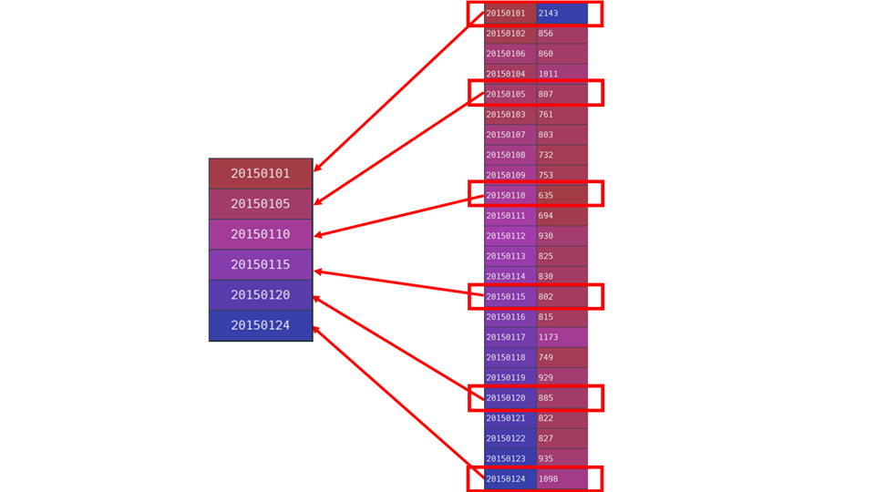
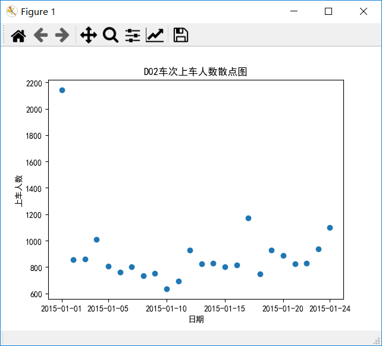
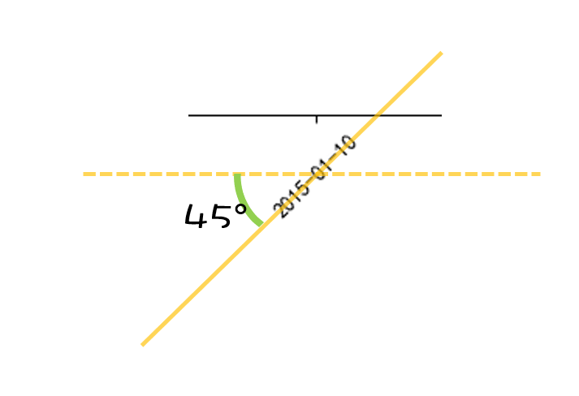
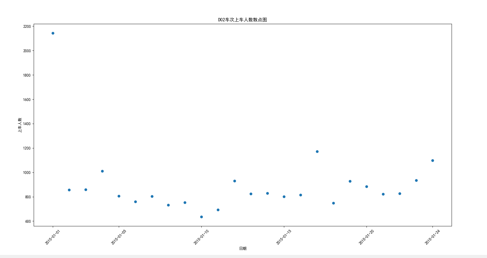

# 散点图

## 4.2.1 散点图

散点图使用`scatter(x, y, [可选项])`来实现



这里，x和y不是单纯的两个数字，无论是x是y都是**一串**数字。

比如我们从想获得D2车次的每个日期以及其对应的上车人数的散点图，我们可以这样做：

```python
import pandas as pd
import numpy as np
import matplotlib.pyplot as plt
path='车次上车人数统计表.xlsx';
data=pd.read_excel(path);
tb=data.loc[data['车次'] == 'D02',['日期','上车人数']];
x=np.arange(1,len(tb.iloc[:,0])+1)
y1=tb.iloc[:,1]
plt.rcParams['font.sans-serif'] = 'SimHei'     # 设置字体为SimHei 
plt.scatter(x,y1)
plt.xlabel('日期')
plt.ylabel('上车人数')
plt.xticks([1,5,10,15,20,24], tb['日期'].values[[0,4,9,14,19,23]], rotation = 45)
plt.title('D02车次上车人数散点图')
```

首先`data=pd.read_excel(path)`相信大家都很熟悉了，就是从excel文件中读取数据并且获得一个DataFrame类型的数据加。下图就是获得的data。



接下来`tb=data.loc[data['车次'] == 'D02',['日期','上车人数']];`，想想这个是做什么的？这里就涉及`iloc`和`loc`函数的使用了。赶紧补补Pandas相关的知识。

总之，这个函数是获得了——首先是行，获得的所有行都是D2车次，然后只取他们的`日期`和`上车人数`这两列。

下图是`tb`的具体内容。



`x=np.arange(1,len(tb.iloc[:,0])+1)`这句，获得了一个数组，数组是从几到几的？好好思考一下。(提示：`len(tb.iloc[:,0])+1 = 25`)

答案如下（把手机倒过来看）：


这是最后一次强调前闭后开的问题了😀。

我们通过x获得了一个数组就是从1~24，那么我们可以把这24个数当作横轴的24个坐标，接下来我们就要给他找对应的y坐标，当然也是24个。

`y1=tb.iloc[:,1]`，这句话的作用是啥呢？获得所有行的第一列




现在我们的`x`有了，`y1`也有了，可以直接绘制了。

```python
plt.rcParams['font.sans-serif'] = 'SimHei'     # 设置字体为SimHei 
plt.scatter(x,y1) # 👈绘制这些点，其实这个记住就行了，绘图的时候的难点都在一些细节上👀
plt.xlabel('日期') # 设置横轴的名字
plt.ylabel('上车人数') # 设置纵轴的名字
plt.xticks([1,5,10,15,20,24], tb['日期'].values[[0,4,9,14,19,23]], rotation = 45)
plt.title('D02车次上车人数散点图')
```

这里说一下`xticks`方法。我们这里面传入了三个参数

+ `[1,5,10,15,20,24]`

+ `tb['日期'].values[[0,4,9,14,19,23]`

+ `45`

首先，`[1,5,10,15,20,24]`规定了我只想要将x轴分成`1、5、10、15、20、24`这几个刻度。

```python
import pandas as pd
import numpy as np
import matplotlib.pyplot as plt
path='车次上车人数统计表.xlsx';
data=pd.read_excel(path);
tb=data.loc[data['车次'] == 'D02',['日期','上车人数']];
x=np.arange(1,len(tb.iloc[:,0])+1)
y1=tb.iloc[:,1]
plt.rcParams['font.sans-serif'] = 'SimHei'     # 设置字体为SimHei 
plt.scatter(x,y1)
plt.xlabel('日期')
plt.ylabel('上车人数')
plt.xticks([1,5,10,15,20,24]) # 👈注意看这句
plt.title('D02车次上车人数散点图')
```

结果如下：



其实从1~24这些数字本身没啥含义，我们想给每个刻度换个名字，换成日期。第二个参数就是干这个的。看`tb['日期'].values[[0,4,9,14,19,23]]`这句话，首先`tb['日期']`获得了`tb`里面的`日期`这一列，数据类型是DataFrame，我们想把它变成一个Numpy数组的话，就要使用`tb['日期'].values`，是不是有点似曾相识？


第三章习题解析里面我们曾经出现过一个问题——pandas的as_matrix方法无法使用，我们必须使用values



大家可以返回去看看。


书归正传，我们获得了`tb['日期'].values`，总共24个日期数据，但是我们只想要6个就行了，直接要第1、5、10、15、20、24个数据，但是计算机中第一个是从0开始的，所以我们只需要获得0、4、9、14、19和23位置上的数据

即



```python
import pandas as pd
import numpy as np
import matplotlib.pyplot as plt
path='车次上车人数统计表.xlsx';
data=pd.read_excel(path);
tb=data.loc[data['车次'] == 'D02',['日期','上车人数']];
x=np.arange(1,len(tb.iloc[:,0])+1)
y1=tb.iloc[:,1]
plt.rcParams['font.sans-serif'] = 'SimHei'     # 设置字体为SimHei 
plt.scatter(x,y1)
plt.xlabel('日期')
plt.ylabel('上车人数')
plt.xticks([1,5,10,15,20,24], tb['日期'].values[[0,4,9,14,19,23]])# 👈注意看这句
plt.title('D02车次上车人数散点图')
```



其实到这里就差不多了，但是作为一个追求完美的人，我们会止步于这样吗？不，我们觉得x轴上的日期刻度太挤了，我想让它倾斜一下，使用rotation参数

```python
import pandas as pd
import numpy as np
import matplotlib.pyplot as plt
path='车次上车人数统计表.xlsx';
data=pd.read_excel(path);
tb=data.loc[data['车次'] == 'D02',['日期','上车人数']];
x=np.arange(1,len(tb.iloc[:,0])+1)
y1=tb.iloc[:,1]
plt.rcParams['font.sans-serif'] = 'SimHei'     # 设置字体为SimHei 
plt.scatter(x,y1)
plt.xlabel('日期')
plt.ylabel('上车人数')
plt.xticks([1,5,10,15,20,24], tb['日期'].values[[0,4,9,14,19,23]], rotation = 45)# 👈注意看这句
plt.title('D02车次上车人数散点图')
```





