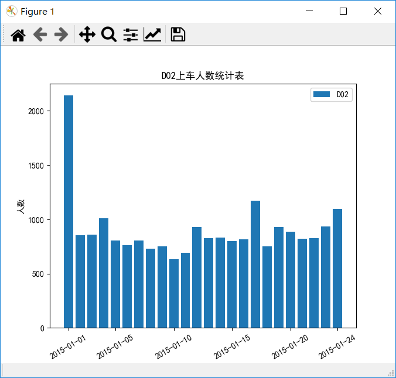
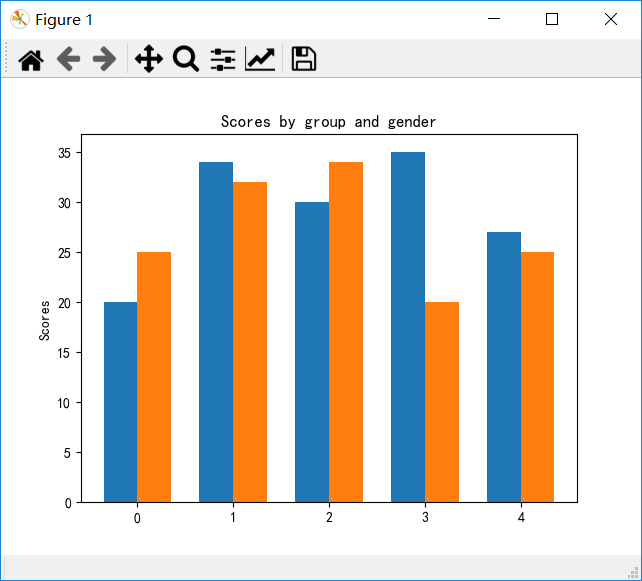
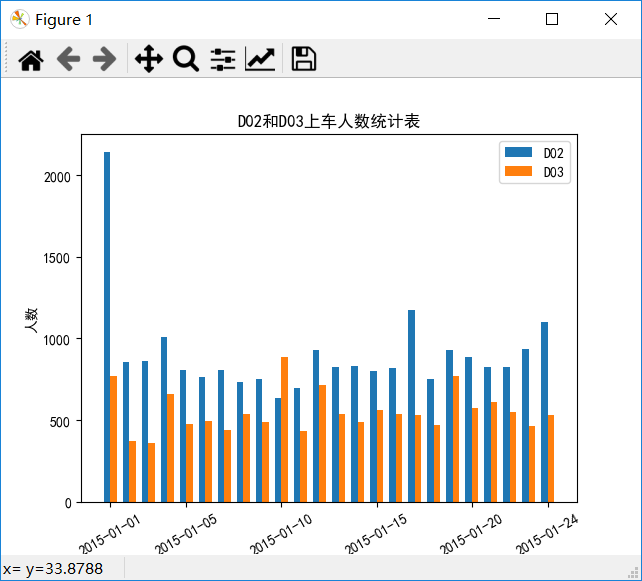

# 柱状图


为啥放上这个图呢？因为柱状图与之前的`plt.plot`用法几乎一样，提供一个x数组，再提供一个y数组，就结束了。

我们就直接用上一节的代码，稍加改动

```python
import pandas as pd
import numpy as np
import matplotlib.pyplot as plt

data = pd.read_excel("车次上车人数统计表.xlsx")

plt.rcParams['font.sans-serif'] = 'SimHei'

tb1 = data.loc[data['车次']=='D02', ['日期', '上车人数']]

tb2 = data.loc[data['车次']=='D03', ['日期', '上车人数']]

x = np.arange(1, len(tb1['日期']) + 1)

y1 = tb1['上车人数']
y2 = tb2['上车人数']

plt.figure(1)

plt.xticks([1, 5, 10, 15, 20, 24], tb1['日期'].values[[0, 4, 9, 14, 19, 23]], rotation=30)
plt.xlabel('日期')
plt.ylabel('人数')

plt.bar(x, y1)#这里发生了改动，把原来的plot函数换掉了。

plt.legend(['D02'])

plt.title('D02上车人数统计表')
```



所以绘制柱状图是很简单的，我们只需要提供x和对应的y即可。


其实柱状图远比你想的功能要多。有没有想过，如果我想一个日期显示两个数据怎么办？比如我想同时看1月1号D02和D03的上车人数柱状图怎么办？

我们先看一下下面的例子：

```python
import matplotlib
import matplotlib.pyplot as plt
import numpy as np


labels = ['G1', 'G2', 'G3', 'G4', 'G5']
men_means = [20, 34, 30, 35, 27]
women_means = [25, 32, 34, 20, 25]

x = np.arange(len(labels))  # the label locations
width = 0.35  # the width of the bars

plt.bar(x - width/2, men_means, width, label='Men')
plt.bar(x + width/2, women_means, width, label='Women')

# Add some text for labels, title and custom x-axis tick labels, etc.
plt.ylabel('Scores')
plt.title('Scores by group and gender')
plt.xticks(x)
plt.xticklabels(labels)
plt.legend()


plt.show()
```



我们来看一下关键语句

```python
plt.bar(x - width/2, men_means, width, label='Men')
plt.bar(x + width/2, women_means, width, label='Women')
```

这里我们是画了两组柱状图而已，第一组（蓝色）是把所有的柱左移每个柱的一半宽度，而第二组（橙色）则是把柱子右移一半的宽度。

那么我们回到我们的问题，如果我想同时显示D02和D03，应该怎么办？


```python
import pandas as pd
import numpy as np
import matplotlib.pyplot as plt

data = pd.read_excel("车次上车人数统计表.xlsx")

plt.rcParams['font.sans-serif'] = 'SimHei'

tb1 = data.loc[data['车次']=='D02', ['日期', '上车人数']]

tb2 = data.loc[data['车次']=='D03', ['日期', '上车人数']]

x = np.arange(1, len(tb1['日期']) + 1)

y1 = tb1['上车人数']
y2 = tb2['上车人数']

plt.figure(1)

plt.xticks([1, 5, 10, 15, 20, 24], tb1['日期'].values[[0, 4, 9, 14, 19, 23]], rotation=30)
plt.xlabel('日期')
plt.ylabel('人数')

bar_width = 0.35#设置每个bar的宽度
plt.bar(x - bar_width/2, y1, bar_width)
plt.bar(x + bar_width/2, y2, bar_width)

plt.legend(['D02', 'D03'])

plt.title('D02和D03上车人数统计表')
```




