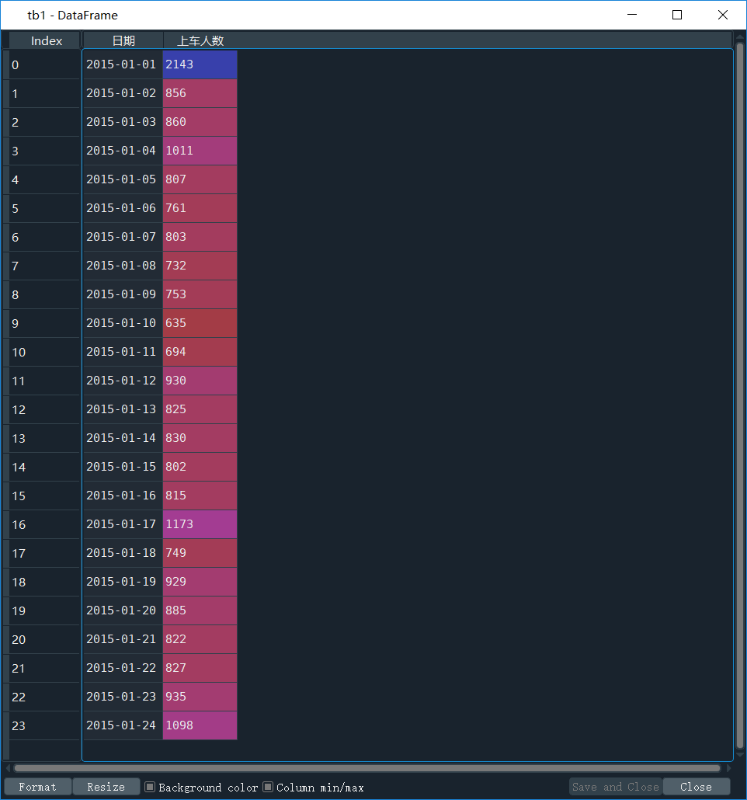
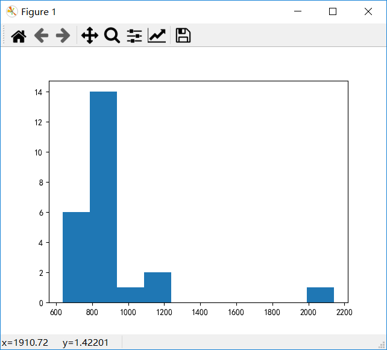
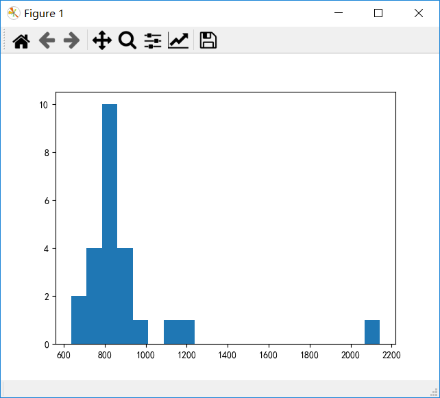

# 直方图

[推荐阅读——matplotlib绘制直方图、条形图和饼图](https://blog.csdn.net/hohaizx/article/details/79101322)

首先我们要知道直方图的意义是什么。

> 直方图是一种统计报告的形式，形式上也是一个个长条形，但是直方图用长条形的面积表示频数，所以长条形的高度表示 `频数/组距`， 宽度表示组距，当宽度相同时，一般用长条形的长度表示频数。

所以一个直方图表示的应该是某个组距内的数出现的“频数/组距”的大小。

那么我们继续看一道题，如果我们想看D2车次上车人数的直方图怎么看？

我们需要使用`hist`函数

```python
import pandas as pd
import numpy as np
import matplotlib.pyplot as plt

data = pd.read_excel("车次上车人数统计表.xlsx")

plt.rcParams['font.sans-serif'] = 'SimHei'

tb1 = data.loc[data['车次']=='D02', ['日期', '上车人数']]

plt.hist(tb1['上车人数'])
```

我们获得的tb1的数据内容为



最后生成的图像为：



在这里，我们获得每一天D02车次的上车人数，使用hist函数，它会自动给这些数据排序，分成默认的10个分组，然后显示每个分组的`频数/组距`的大小。

那如果我想要把它分成20组呢？

我们可以这样写

```python
import pandas as pd
import numpy as np
import matplotlib.pyplot as plt

data = pd.read_excel("车次上车人数统计表.xlsx")

plt.rcParams['font.sans-serif'] = 'SimHei'

tb1 = data.loc[data['车次']=='D02', ['日期', '上车人数']]

plt.hist(tb1['上车人数'], 20)#👈注意看这一句，我们加了什么
```



