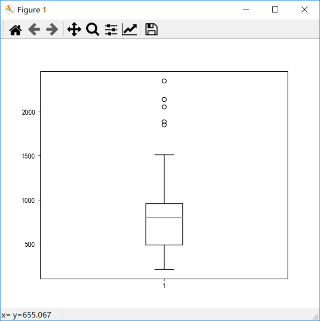
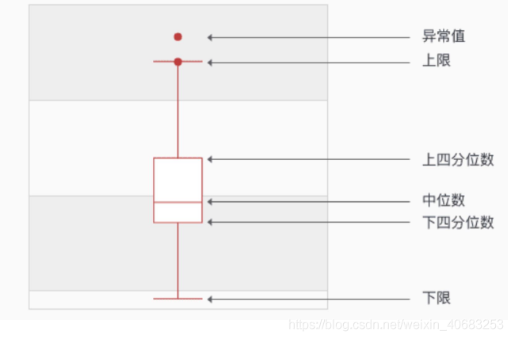
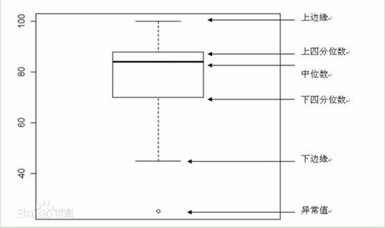
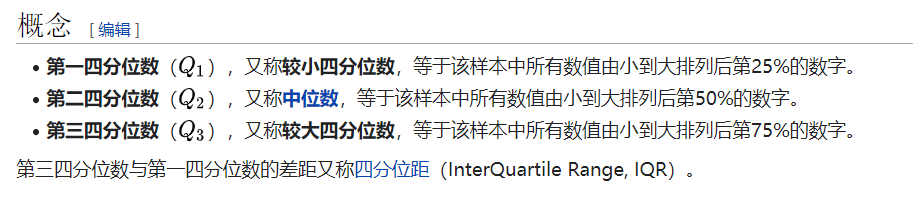
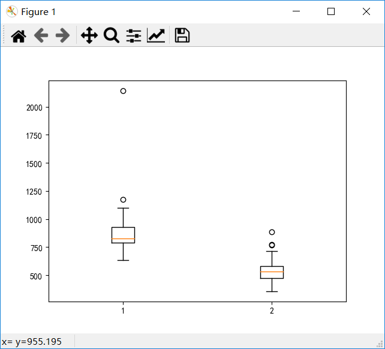
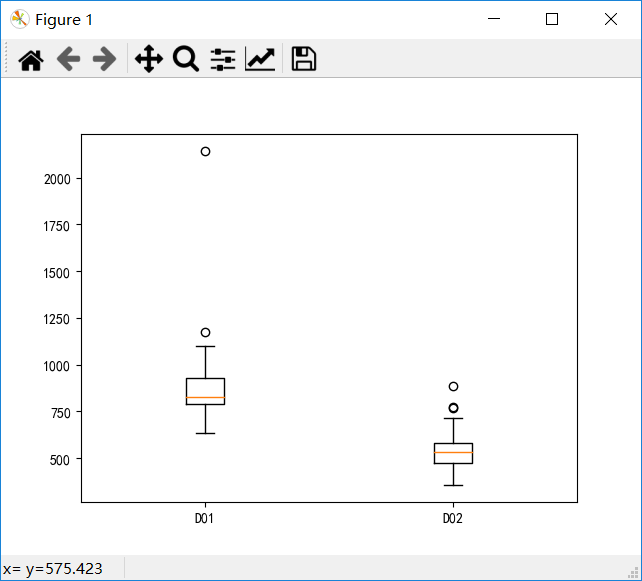

# 箱线图



生成本图的代码

```python
import pandas as pd
import numpy as np
import matplotlib.pyplot as plt

data = pd.read_excel("车次上车人数统计表.xlsx")

r = data.loc[:, '上车人数']

plt.boxplot(r)
```

我们来理解一下箱线图

## 箱线图的构成







一个箱线图表示的是一组数据的分布情况。我们只需要提供一组数据，他就会自动为我们生成箱线图。

## 绘制箱线图

按照书上的例子，假设我们想要获得D02和D03车次的上车人数箱线图，应该怎么做？

```python
import pandas as pd
import numpy as np
import matplotlib.pyplot as plt

data = pd.read_excel("车次上车人数统计表.xlsx")

r1 = data.loc[data['车次']=='D02', '上车人数']
r2 = data.loc[data['车次']=='D03', '上车人数']

plt.boxplot([r1.values, r2.values])
```



x轴上这个1和2没啥意义啊，我们把它换成‘D02’和‘D03’吧。

```python
import pandas as pd
import numpy as np
import matplotlib.pyplot as plt

data = pd.read_excel("车次上车人数统计表.xlsx")

r1 = data.loc[data['车次']=='D02', '上车人数']
r2 = data.loc[data['车次']=='D03', '上车人数']

plt.boxplot([r1.values, r2.values])
plt.xticks([1, 2], labels=['D01', 'D02'])
```

