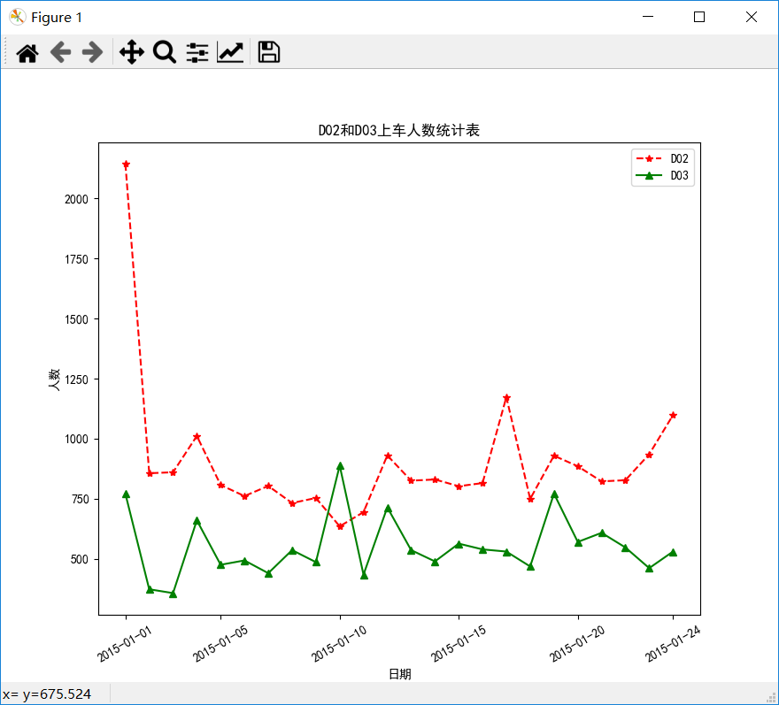
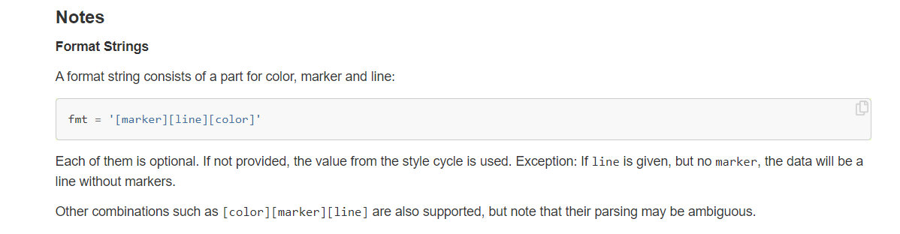
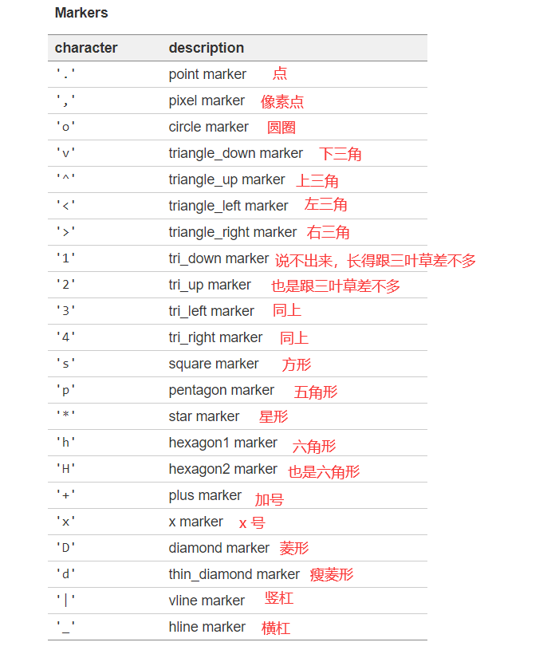
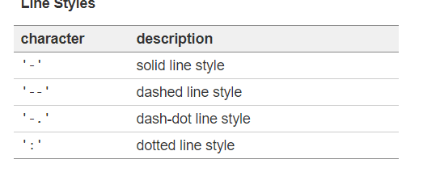
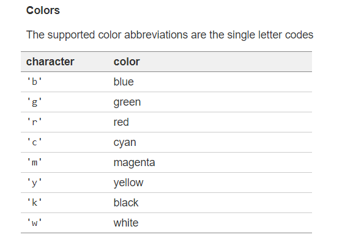
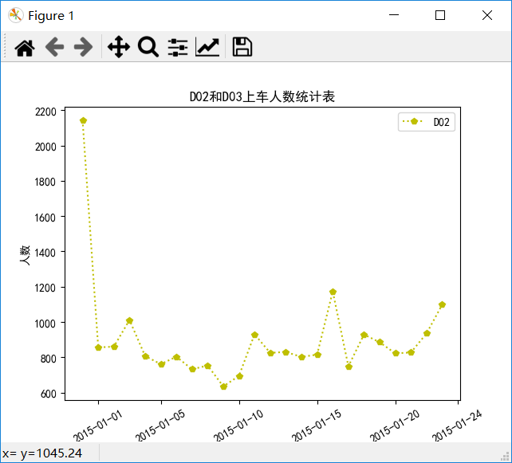

# 线性图

本节用到的数据"车次上车人数统计表.xlsx"

[点击进入百度网盘](https://pan.baidu.com/s/1MEkCX8PTnGXaf3jFj_GVQg)

提取码：ne99

本节课本里写的优点太乱，读者可以使用下面的代码：

```python
import pandas as pd
import numpy as np
import matplotlib.pyplot as plt

data = pd.read_excel("车次上车人数统计表.xlsx")

plt.rcParams['font.sans-serif'] = 'SimHei'

tb1 = data.loc[data['车次']=='D02', ['日期', '上车人数']]

tb2 = data.loc[data['车次']=='D03', ['日期', '上车人数']]

x = np.arange(1, len(tb1['日期']) + 1)

y1 = tb1['上车人数']
y2 = tb2['上车人数']

plt.figure(1)

plt.xticks([1, 5, 10, 15, 20, 24], tb1['日期'].values[[0, 4, 9, 14, 19, 23]], rotation=30)
plt.xlabel('日期')
plt.ylabel('人数')

plt.plot(x, y1, '*--r')

plt.plot(x, y2, '^-g')

plt.legend(['D02', 'D03'])

plt.title('D02和D03上车人数统计表')
```




代码中很多步骤在上一节重复写过，这里就不写了。主要说一下在课本（《python金融数据分析与挖掘实战》）中出现的一些不恰当的地方。

绘制折线的时候，书上使用的是

```python
plt.plot(x, y1, 'r*--')
plt.plot(x, y2, 'b*--')
```

这么写的含义是：

`r`代表红色，`*`代表每个点用星形符号绘制，`--`代表折线使用虚线。

同理

`b`代表蓝色，`*`代表每个点用星形符号绘制，`--`代表折线使用虚线。

但是官方建议的书写顺序是下面这样的



<u>ambiguous：含混不清的。</u>

官方推荐的方式是`“点格式+线格式+颜色”`，如果颠倒顺序，可能会造成一些混乱

也就是说，我们需要把书上的代码写成

```python
plt.plot(x, y1, '*--r')
plt.plot(x, y2, '*--b')
```

这样才更加严谨。

当然，我这里写的代码用的是

```python
plt.plot(x, y1, '*--r')

plt.plot(x, y2, '^-g')
```

第一个你已经认识了，第二个呢？

`^`代表尖朝上的三角形，`-`代表折线用直线，`g`代表使用绿色

下面给出一些常用的格式

**点格式：**



---


**线格式：**



`-`实心线

`--`虚线

`-.`虚线和点交替

`:`纯点

---


**颜色格式：**



比如我们想绘制一个图，每个点都是五角星，线要用一个个小点点绘制，颜色是黄色，该怎么画？

`plt.plot(x, y1, 'p:y')`



猜对了没？