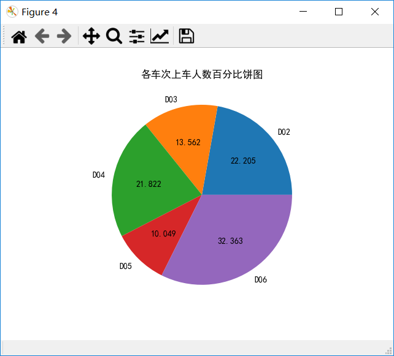

# 饼图


要想画出一个完美的饼图，你需要提供两样数据

一个是所有类别的名字，另一个是每个类别对应的总数。

```python
import pandas as pd
import numpy as np
import matplotlib.pyplot as plt

data = pd.read_excel("车次上车人数统计表.xlsx")
plt.rcParams['font.sans-serif'] = 'SimHei'   
# 4.2.5 饼图
plt.figure(4)
# 1.计算D02～D06车次同期的上车人数总和，并用list1来保存其结果 
D=data.iloc[:,0] 
D=D.unique()  #车次号D02～D06
list1=[]    #预定义每个车次的上车人数列表 
for d in D:
    dt=data.loc[data['车次'] == d,['上车人数']]
    s=dt.sum()
    list1.append(s['上车人数']) #或者s[0]
# 2.绘制饼图
plt.pie(list1,labels=D,autopct='%1.2f%%') #绘制饼图，百分比保留小数点后两位
plt.title('各车次上车人数百分比饼图') 
plt.savefig('myfigure4')
```

如上述代码，

我们获得的data数据为


首先我要获得**所有类别的名字**（即D02、D03、D04、D05、D06）

`D=data.iloc[:,0] `说明我要获得整个表的第一列。


但是很明显这些数据有很多重复的名字，接下来就要使用DataFrame数据类型的unique方法，来去除重复的部分。

`D=D.unique()`


然后我们创建一个列表，来存每个车次对应的总人数。

```python
list1=[]    #创建一个列表
for d in D:
    dt=data.loc[data['车次'] == d,['上车人数']]
    s=dt.sum()
    list1.append(s['上车人数']) #或者s[0]
```

这里我们要介绍一下DataFrame的sum函数

当我使用sum函数的时候，默认是按列计算，可以试试下面这段代码

```python
import pandas as pd
import numpy as np
import matplotlib.pyplot as plt

data = pd.read_excel("车次上车人数统计表.xlsx")

res = data.sum()
```


他把每一列都直接加了起来。如果我想获得某一个列的数据，那么我可以这样写

```python
import pandas as pd
import numpy as np
import matplotlib.pyplot as plt

data = pd.read_excel("车次上车人数统计表.xlsx")

re = data.sum()

number = re['上车人数']
```


好，现在回到我们的正题中

```python
list1=[]    #创建一个列表
for d in D:
    dt=data.loc[data['车次'] == d,['上车人数']]
    s=dt.sum()
    list1.append(s['上车人数']) #或者s[0]
```

现在这段代码你一定能看得懂了。


所有现在我们有了一个`D`，记录着所有的车次的名字，有了一个`list1`，存储着对应的数据，那么接下来我们就可以直接使用饼图了。

```python
# 2.绘制饼图
plt.pie(list1,labels=D,autopct='%1.2f%%') #绘制饼图，百分比保留小数点后两位
```

最后总代码为

```python
import pandas as pd
import numpy as np
import matplotlib.pyplot as plt

data = pd.read_excel("车次上车人数统计表.xlsx")
plt.rcParams['font.sans-serif'] = 'SimHei'   
# 4.2.5 饼图
plt.figure(4)
# 1.计算D02～D06车次同期的上车人数总和，并用list1来保存其结果 
D=data.iloc[:,0] 
D=D.unique()  #车次号D02～D06
list1=[]    #预定义每个车次的上车人数列表 
for d in D:
    dt=data.loc[data['车次'] == d,['上车人数']]
    s=dt.sum()
    list1.append(s['上车人数']) #或者s[0]
# 2.绘制饼图
plt.pie(list1,labels=D,autopct='%1.2f%%') #绘制饼图，百分比保留小数点后两位
plt.title('各车次上车人数百分比饼图') 
```

最后再补充一点就是格式化的问题

`plt.pie(list1,labels=D,autopct='%1.2f%%')`

如果我们不加`autopct='%1.2f%%'`的话

即

`plt.pie(list1,labels=D)`

我们的输出会是这样的德行


没有百分比。

如果我们想显示百分比的话，需要自定义格式

`autopct='%1.2f%%'`的含义是将百分数格式化为保留两位小数的带百分号的数字

我们来看看这个格式，首先是`%`打头，这个是固定的格式

然后是你想保留的小数点位置，这个`1.2f`里的1可以直接换成0，即`0.2f`，那如果我想保留三位小数呢？就写`0.3f`就可以了。

别忘了我们还要跟一个百分号呢，我们用两个百分号`%%`来指明这里需要跟着一个百分号

所以最后结果就是这样的。


最后练习一下，如果我想输出三位小数，并且不加百分号，该怎么做？


```python
plt.pie(list1,labels=D, autopct='%0.3f')
```

